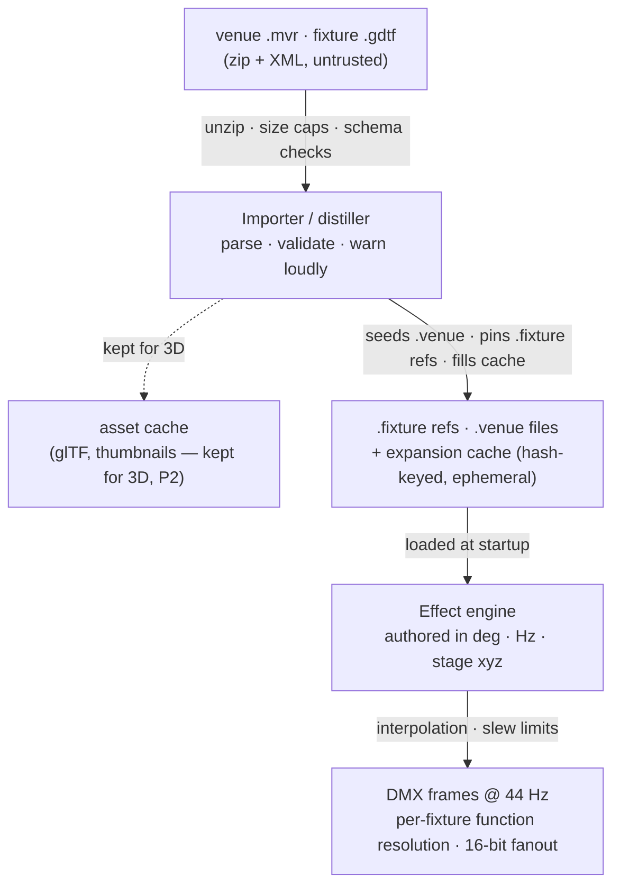

# Venue Exchange: GDTF/MVR Import, the Rich Fixture Model, and Physical-Unit Movement

*Design doc, draft 5 — 2026-08-19. Draft 5 revises the file-format story
after implementation review: the extension identifies the DSL generation (v1
`.light` files are not renamed or migrated), the intermediary model is
machine-only, the DSL is scoped to the datasheet-typable subset, and every
DSL construct ships in the same phase as its consumer.*

> **Terminology:** today there is exactly one fixture/venue definition
> syntax — the `.light` DSL. This document calls it "v1" only to contrast it
> with the **planned** extended syntax ("v2") that phases P1a–P1c will
> introduce under the `.fixture`/`.venue` extensions; until those phases
> ship, no v2 DSL exists. Show files are neither versioned nor touched by
> this design. Feature scope is named by phase (P0–P2), never by version
> number.

mtrack shows already target roles — tags and logical groups — rather than fixtures, and a
show plays across multiple venues today. What doesn't scale is everything underneath: every
fixture definition and venue patch is hand-transcribed, capabilities are inferred from
channel-name strings, and movement has no physical vocabulary. This design fills that in:
fixture definitions sourced from manufacturer GDTF files, venue patches imported from MVR,
movement authored in degrees and stage coordinates instead of raw DMX, and a pre-show lint
that answers "will my show work there?" before the van leaves.

## 1. Goals & non-goals

**Goals.**

- Import a manufacturer `.gdtf` file and get a correct, reviewable mtrack fixture_type
  without reading a manual. (Proven exact for the Astera PixelBrick: the distilled file
  matched the hand-written one byte-for-byte, including strobe DMX offset and Hz range.)
- Import a venue's `.mvr` file and get a playable venue: patch, positions, fixture types.
- Author movement in physical units (`pan: 130deg`, `focus: "drummer"`) so shows transfer
  between fixtures and venues.
- 16-bit channel support, required for smooth movement.
- A venue visualizer grounded in real positions; full 3D lighting simulation in phase 2.
- Lint that reports capability gaps, unresolvable groups/focus points, and infeasible moves
  per venue.

**Non-goals (initial scope).** GDTF/MVR *writing* (deferred; the model is designed to be exportable).
Wheels, gobos, matrix/pixel modes, RDM (skipped loudly on import). Full geometry-tree
kinematics (tier-3 fidelity visualizers need; simple spherical pointing math suffices — §8).
OFL import (possible later addition for hobbyist gear; not in scope here).

## 2. Settled decisions

| Decision | Choice | Why |
|---|---|---|
| GDTF parser | Own implementation (quick-xml) | Spec is public and well-specified (DIN SPEC 15800). gdtf-rs is read-only, single-maintainer, 1-star; we'd own it either way. We control subset, leniency, and error reporting. |
| MVR parser | Own implementation | No Rust crate exists. Simpler format; reuses our GDTF machinery for embedded fixtures. |
| Fixture sourcing | GDTF-sourced fixtures are *referential*: a thin `.fixture` file names the GDTF + mode (+ overrides); the expanded channel table is an ephemeral cache, never committed | Fixture data is a manufacturer fact — a fat distilled copy can only drift from its source. The cache pattern (hash-keyed, regenerated on change) is the waveform-cache model mtrack already has. |
| Venue sourcing | MVR import *seeds* an owned `.venue` file | Venues are authored, not derived: tags, focus points, and position tweaks are human judgment layered on the import. |
| File extensions | `.fixture`/`.venue` will identify the planned v2 DSL as P1a–P1c introduce its constructs; existing definitions stay in `.light` files, valid beside them | The extension *is* the version marker (versions mark breakages, not expansions). This design renames, migrates, and deprecates nothing, and there is no in-file version field. No v1 removal is scheduled — retiring v1 someday is a legitimate future decision, but it would be its own design, with its own migration story. |
| GDTF/MVR export | Deferred (phase 2+) | Nothing in the initial phases depends on it; model stays exportable. |
| Visualizer | 2D top-down in phase 1; real 3D simulation in phase 2 | Positions/orientations/beam data and glTF assets are retained from import day one so 3D is additive, not a re-import. |
| Position abstraction | Named focus points, bound per-venue | The positional analog of tags: shows say `focus "drummer"`; venues supply coordinates. |
| Legacy path | MIDI-to-DMX layer untouched | It's the working fallback while this lands. |
| Intermediary | The serde model and its cache are **machine-only** — never hand-edited, never a user-facing format | GDTF and the DSL are the two sources; both compile into the intermediary. Letting users hand-craft a compilation target forfeits its derived/rebuildable property. |
| DSL scope | The DSL models the **datasheet-typable** subset of what the engine consumes | Asset-class data — 3D meshes, geometry trees, gobo images, spectral/emitter data — is GDTF-only; no text format can carry it, and everything downstream degrades gracefully without it (generic body, cone from beam angle, sRGB-ish color). |
| Syntax delivery | Every DSL construct ships in the same phase as its engine consumer | Defined-but-inert syntax invites files that look configured but aren't, and freezes grammar shape before a consumer exists to pressure-test it. |

## 3. Architecture

The load-bearing structural claim: **untrusted zip/XML is parsed by one hardened path, once
per new or changed source file — never at show time.** MVR import seeds owned `.venue`
files. GDTF fixtures stay referential: a `.fixture` file pins the source archive and mode,
and the distiller expands it into a hash-keyed cache (the waveform-cache pattern — filled at
import or prewarm, invalidated when the GDTF or the distiller version changes). Show time
reads only native files and a warm cache; a cold cache at startup fills with a loud log
line, never silently at a cue.



Trust boundary: everything above the `.fixture`/`.venue` + cache line is **parse time**
(import / prewarm — the only place untrusted input is touched); everything below is **show
time** (native files + warm cache only).

## 4. Data model

### 4.1 Fixture types: `.fixture` files

Two forms, one runtime model. The common path is a **referential** fixture: the GDTF archive
is the source of truth, the file pins it and carries only human additions. The distiller's
expansion (full channel table, function ranges) lives in the hash-keyed cache, never on disk
as an editable file — so it cannot drift from its source, and a distiller improvement
reaches every fixture on next prewarm.

```
# spots/robe-esprite.fixture — referential (GDTF is the source of truth)
fixture_type "Robe-Esprite"
  from gdtf("library/Robe@Esprite@V1.1.gdtf", mode "Mode 1")
{
  # overrides and additions only — not in GDTF (§8)
  movement { max_pan_speed: 240deg/s  max_tilt_speed: 200deg/s }
}
```

The **native** form is the escape hatch for gear with no usable GDTF, and is what the
expanded model looks like — structured channels with fine bytes, physical ranges, and
DMX-range functions. Capability derivation moves from channel-name string matching to
declared data in both forms. Grammar decision: **hybrid** — a channel is a name-keyed
one-liner, taking a block only when it has structure, so simple fixtures stay as terse as v1.

```
# native (hand-authored) — also the shape of a cached expansion
fixture_type "House-Blinder" {
  channels: 4
  channel "dimmer" @ 1 fine 2
  channel "red"    @ 3
  channel "strobe" @ 4 {
    functions: { "off": 0..7, "strobe": 64..255 -> 0.3hz..25.0hz }
  }
}
```

Canonical channel names (`red`, `dimmer`, `pan`, `ct`, …) are produced by the distiller from
GDTF's standardized attributes (`ColorAdd_R`, `Dimmer`, `Pan`, `CTC`), making the distiller
the normalizer — multi-user configs stop diverging on spelling. Debuggability:
`mtrack lighting expand <fixture>` (and the webui detail view) dumps the resolved model,
since a referential fixture's runtime truth isn't otherwise a text file you can read.
Existing `.light` fixture files (`channel_map` + three strobe fields) stay valid,
unrenamed and unmigrated, and will load beside v2 files once those exist; internally
both normalize through one conversion point (`From<FixtureTypeV1>`). "Detach to
native" renders control data as DSL and is lossy w.r.t. GDTF asset data (which has no
textual form) — it says so loudly. **None of the syntax shown in this section exists
yet**: it is the v2 target, and each construct lands with its consumer (§13), never
ahead of it.

### 4.2 Venues: `.venue` files and focus points

Venues are authored, so MVR import *seeds* a `.venue` file you then own — tags, focus
points, and position corrections are yours, and re-importing a revised MVR diffs against
your file rather than replacing it.

```
# kellys-basement.venue
venue "kellys-basement" {
  # mtrack stage convention: meters, right-handed Z-up, origin at
  # downstage-center on the deck · +x stage-left · +y upstage · +z up
  fixture "Spot1" "Robe-Esprite" @ 1:1
    tags ["spot", "rear"]
    position (-2.0, 3.5, 4.2)  rotation (0, 0, 180)

  focus "drummer"      (0.0, 2.8, 1.4)
  focus "center-stage" (0.0, 1.5, 1.7)
}
```

Tags remain the role abstraction; **focus points are the positional equivalent**. Shows
reference focus names, venues bind coordinates. Position/rotation are optional — a venue
without them still plays; it just can't resolve positional effects or draw a meaningful
stage view, and lint says so.

## 5. GDTF parser (owned)

quick-xml over the extracted `description.xml`, into a spec-shaped object model, then
distillation. We read the subset the distiller needs and skip the rest *loudly* — every skip
is a named warning in the import report, per the harness's assume-everything/skip-loudly
stance.

| Read | Skip (warn) |
|---|---|
| FixtureType metadata; AttributeDefinitions; DMXModes → DMXChannels → LogicalChannels → ChannelFunctions → ChannelSets (offsets, fine bytes, DMX ranges, physical from/to); Geometries (enough to resolve channel→geometry references and skip virtual channels); beam data (angles); Revisions (provenance) | Wheels & gobo resources; matrix/pixel template channels; FTPresets; Protocols; RDM; emitters/filters/CRI. Models (glTF) aren't parsed but are copied to the asset cache for phase 2. |

Known wrinkles, all hit in the PixelBrick experiment: **virtual channels** (no DMX offset —
excluded from footprint), **multi-function channels** (pick dominant per canonical name,
keep function table), **mode selection is human input** (importer lists modes with
footprints; `--mode` or UI picker required).

> **Security posture:** an MVR is a zip a stranger emails the band, parsed by the machine
> that runs the show. The extraction layer enforces: no path traversal (zip-slip), no
> symlinks, per-entry and total decompression caps, entry-count caps, XML depth/size limits,
> no DTD/entity expansion (quick-xml default — keep it that way). Both parsers are
> cargo-fuzz targets from day one.

## 6. MVR parser (owned)

Zip containing `GeneralSceneDescription.xml` plus embedded GDTF files. We read: layers →
fixtures (name, `GDTFSpec` reference, `GDTFMode`, address, universe, 3D transform), and hand
each embedded GDTF to the §5 pipeline. Output: a seeded `.venue` file with positions, plus
`.fixture` refs for every referenced fixture. Fixtures whose GDTF is missing or unparseable
become explicit `TODO` entries in the venue file — the import never silently drops a patched
fixture.

**Coordinates:** MVR is right-handed Z-up in millimeters with an *author-chosen* origin —
the spec fixes no stage origin. Import converts to mtrack's stage convention (meters, origin
downstage-center; §4.2) and includes a re-origin step: the user picks a reference point or
fixture, since every venue's file will be offset differently.

**Mode matching:** the spec requires `GDTFMode` to name a mode in the GDTF exactly, but real
console exports drift (truncation, re-punctuation). Fallback chain: exact match → normalized
match (case/whitespace/punctuation; warn) → unique DMX-footprint match (only one mode has
the patched channel count; warn) → hard error listing candidate modes.

## 7. Import pipeline & library management

- **Entry points:** `mtrack lighting import-gdtf <file> --mode <name>`,
  `mtrack lighting import-mvr <file>`, and webui upload with a mode picker. Both produce the
  same import report (what was read, what was skipped, what needs human input). Import =
  validate the archive, copy it into the library, write the `.fixture` ref (and seed the
  `.venue`), fill the cache.
- **Layout:** `.fixture`/`.venue` files where fixture_types/venues live today. GDTF archives
  under `lighting/library/` — *committed*, since they're now the source of truth a
  referential fixture resolves against. Expansions and extracted assets (glTF, thumbnails)
  under `lighting/.cache/` — gitignored, rebuildable.
- **Invalidation:** cache key = GDTF content hash + mode + distiller version + override
  hash. A changed archive or upgraded distiller regenerates on prewarm; the import report
  and lint both surface when a resolved fixture changed since last run, so an upgrade never
  silently reshapes a working rig on gig day.
- **Editing:** the webui shows referential fixtures as a read-only resolved view (provenance
  banner: archive, mode, revision) plus an editable overrides pane; native fixtures get the
  full editor (fine bytes, ranges, functions, movement speeds). "Detach to native" copies
  the expansion into an editable file for the rare full-tweak case.

## 8. Engine: the physical-value pipeline

Movement is what breaks the write-a-value-to-a-named-channel model. The engine gains one
layer:

1. **Effects emit physical intents** — pan/tilt in degrees (or a focus-point target), strobe
   in Hz, color as today. Color/dimmer effects keep their existing semantics; nothing about
   the explicit-durations effect model changes.
2. **Per-fixture resolution** maps intents through the resolved fixture model: degrees →
   channel-function DMX range interpolation; focus targets → pan/tilt via pointing math
   (below); one logical value → coarse+fine bytes (16-bit fanout) in `to_dmx_commands`.
   Color lives here too: shows keep `red`/`green`/`blue` parameters exactly as today,
   CCT/white channels are handled in this layer, and physical color params
   (`color_temp: 3200K`) are purely additive.
3. **Interpolation & slew:** movement interpolates in physical space at the 44 Hz tick
   (44 Hz is ample; 8-bit quantization was the real smoothness problem). Configured
   `max_pan_speed` clamps output; lint flags cues that demand more than the fixture can do.

Positions also give chase *direction* real meaning: today `left_to_right`
orders fixtures by their position in the resolved group list, which has no
spatial (or cross-universe) significance. Once venues carry positions, chase
ordering resolves from them, with list order as the fallback for
position-less venues.

**Pointing math (tier 2, not tier 3):** fixture position + mounting rotation + pan/tilt
ranges → spherical solve for "aim at (x,y,z)". No geometry-tree kinematics; a page of
trigonometry, property-tested (§12). Fixtures with unattainable targets (out of range) clamp
and warn.

**Effect language sketch:**

```
effect "verse-sweep" {
  target: group("spots")
  focus: "center-stage" -> "drummer"   # physical, venue-resolved
  duration: 2 bars
  easing: smooth
}
```

## 9. Visualization

**Phase 1 — positional 2D.** StageView stops faking layout from tags: top-down stage plot
from venue positions, orientation ticks, beam-direction cones for movers (from live pan/tilt
state + beam angle), live color/intensity overlay from the existing 20 Hz snapshots
(snapshots gain position + pointing data). Fixtures without positions fall back to today's
tag layout, visually marked. Focus points are draggable pins — this is also the focus-point
editing UI.

**Phase 2 — 3D simulation.** Real 3D pre-viz: venue space, fixture bodies from the cached
glTF models, beam rendering, "play the show against a venue you've never seen." Everything
phase 2 needs (transforms, beam data, models) is captured and stored in phase 1 — 3D is a
rendering project, not a data-model project.

## 10. Surfaces

- **webui API:** upload endpoints for `.gdtf`/`.mvr` (import report as the response), mode
  listing, focus-point CRUD, fixture-type editing CRUD.
- **MCP:** `list_fixture_types` gains capabilities/ranges/provenance; venue tools gain
  positions and focus points; `evaluate_show` gains the new lint classes. The import flow
  gets first-class tools — `list_gdtf_modes`, `import_gdtf`, `import_mvr`, import-report
  retrieval — so an AI agent can close the loop end-to-end: fetch the GDTF from the
  manufacturer's site, pick the mode against the patch sheet, import, and read back the
  warnings. "Get the file from the manufacturer" stops being a chore when an agent can do it.
- **Docs:** new import + touring-workflow guide (sourcing GDTFs from the manufacturer or
  GDTF-Share is the documented user path — mtrack never fetches them itself); regenerate
  screenshots (StageView changes substantially).

## 11. Lint & pre-show analysis

The tool a touring user runs when the venue's file arrives. New checks on top of the
existing group-resolution lint:

- Capability coverage: show uses strobe/movement/CT in a group whose venue fixtures can't do
  it (with the degradation the profile will apply, stated).
- Focus points referenced by the show but unbound in the venue.
- Movement feasibility: cue requires more than `max_*_speed`, or target outside pan/tilt
  range from a fixture's position.
- Positional effects against a venue without positions.
- Universe coverage: the venue patches fixtures on universes the active
  profile configures no output for (today this is reported loudly at venue
  registration and on first drop; lint makes it a pre-show answer).
- Import hygiene: fixture_types whose source GDTF has a newer revision in the library.

## 12. Testing

- **Golden corpus, two tiers:** (1) synthetic GDTF/MVR files we author — committed, full
  spec-feature coverage (virtual channels, 16-bit, multi-function channels, matrix modes
  that must skip loudly, sloppy MVR mode strings); this tier is the CI backbone. (2) Real
  manufacturer files as a *bring-your-own local corpus*: a gitignored `tests/gdtf-corpus/`
  directory a developer fills (e.g. the Astera library), run via a manual/`#[ignore]`d test
  target, with a checksummed manifest recording which file versions produced the committed
  snapshots. No CI fetches from manufacturer sites — those URLs rot and block non-browser
  clients, and a red build from a vendor's CDN is noise, not signal.
- **Fuzzing:** cargo-fuzz targets for the zip layer and both XML parsers; malformed-archive
  regression suite (zip-slip, bombs, truncations).
- **Property tests:** pointing math round-trips (aim → pan/tilt → direction), 16-bit fanout
  monotonicity (no coarse-byte jumps across fine rollover), physical-range interpolation
  against channel-function tables.
- **Equivalence:** parsing a v1-DSL definition into the internal model is lossless —
  identical channel maps and strobe parameters — and existing configs produce
  byte-identical DMX. A referential PixelBrick (`from gdtf(...)`) resolves identically
  to its native-form equivalent.
- **Cache correctness:** expansion regenerates on archive hash, mode, distiller-version, or
  override change — and only then; cold-cache startup fills loudly and deterministically.
- **Harness:** a DMX frame-capture sink joins the audio loopback — hardware e2e checks
  assert emitted frames: strobe function offsets, 16-bit continuity during a slow sweep,
  slew clamping, focus resolution on a venue with known geometry.
- **webui e2e:** import flow (upload → mode pick → report → files exist), focus-point
  editing, positional StageView.

## 13. Phasing

| Phase | Scope | Exit criterion | Size |
|---|---|---|---|
| P0 | Internal only: rich fixture model (the v1-DSL view derived, `From<FixtureTypeV1>` conversion) + expansion cache plumbing; no grammar, no new extensions, no user-facing surface | Existing configs produce byte-identical DMX; cache fill/hit/corruption covered | S |
| P1a | GDTF parser + distiller, CLI + webui import, corpus + fuzzing, security hardening. **Introduces** the `.fixture` extension and referential syntax (`from gdtf(...)`, `movement`) — born working | PixelBrick distills byte-identical; a 16-ch+ mover distills with only expected warnings | M |
| P1b | MVR import, positions, focus points, positional 2D StageView, lint expansion. **Introduces** the `.venue` extension and `position`/`rotation`/`focus` syntax | A real venue MVR imports to a playable venue; show lint runs against it | M |
| P1c | Physical-value pipeline, 16-bit fanout, movement effects, slew model, harness DMX sink. **Introduces** rich channel syntax (`fine`, `range:`, function tables) for hand-authored fixtures | A movement show authored on one venue plays correctly on a second imported venue | L |
| P2 | 3D simulation (glTF, beam rendering); GDTF/MVR export; optionally OFL import | Show playable against a 3D venue never visited | L–XL |

Each phase ships independently; P1a is already useful alone (import replaces hand
transcription). Grammar follows the same rule as everything else here: a DSL construct
is introduced by the phase whose engine work consumes it, never earlier — so at no
point does syntax exist that parses but does nothing. The legacy MIDI-to-DMX path
stays untouched throughout as the working fallback.

## 14. Resolved questions

Open in draft 2; all resolved by draft 4.

1. **Coordinate convention** — stage-relative: meters, right-handed Z-up, origin at
   downstage-center on the deck, +x stage-left, +y upstage. MVR (right-handed Z-up,
   *millimeters*, author-chosen origin) is converted at import with a re-origin step (§6).
2. **v2 DSL grammar (planned, not shipped)** — hybrid: name-keyed channel one-liners,
   optional block only where a channel has structure (§4.1); constructs ship with their
   consumers (P1a–P1c). Simple fixtures stay as terse as v1. The v1 grammar is frozen,
   not deprecated: `.light` fixture/venue files remain valid, and no removal is
   scheduled. Retiring v1 is out of scope here — if it ever happens, it arrives as its
   own design with its own migration story.
3. **Corpus licensing** — sidestepped via the two-tier corpus (§12): committed synthetic
   files we author are the CI backbone; real manufacturer files are a bring-your-own local
   corpus, never fetched by CI (vendor URLs rot and block non-browser clients — brittle by
   construction). Users source their own GDTFs from the manufacturer; the MCP import tools
   (§10) let an AI agent do that legwork.
4. **Slew defaults** — no public database exists (verified; datasheet travel times like
   "540° in 2.2s" are the only common source). So: one conservative shipped default (order
   100°/s), per-fixture override, lint-only consequences (a wrong value is a noisy warning,
   never wrong DMX). The fixture editor accepts datasheet notation directly
   (`540deg / 2.2s`). Calibration is a *guided webui flow* first, CLI second: pick fixture →
   it sweeps full travel → tap when it stops → value written to the override; no extra
   hardware.
5. **Color model scope** — CCT/white handling enters the initial engine work (P1c) in the resolution layer only; show
   DSL parameters unchanged (RGB-first as today), physical color params additive (§8).
   Spectral/calibrated cross-fixture matching deferred to P2.
6. **Mode identity in MVR** — fallback chain: exact → normalized (warn) → unique-footprint
   (warn) → error with candidates (§6).
7. **Cache scope** — per-project `lighting/.cache/`.
8. **Format versioning** — no in-file version field. The extension is the version marker,
   and versions mark breakages, not expansions: additive syntax never mints a new
   generation, and changing the meaning of existing syntax is forbidden (new meaning
   requires new syntax). A v3 would arrive as a new extension, if it ever exists.
