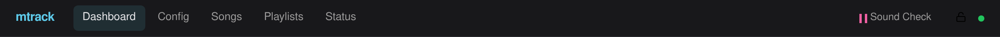
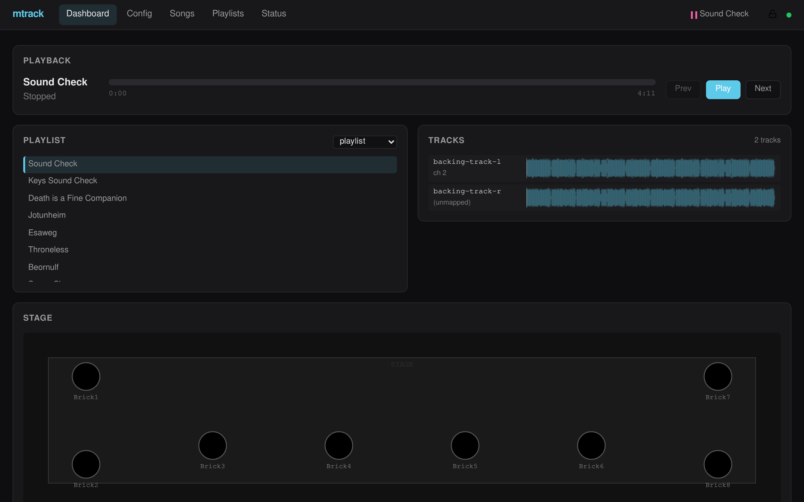
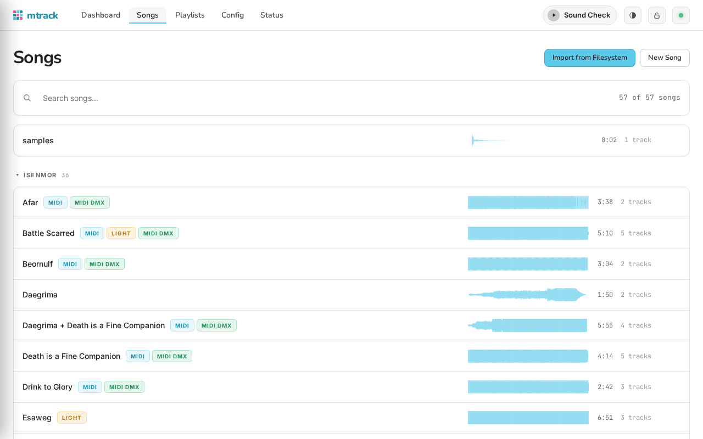
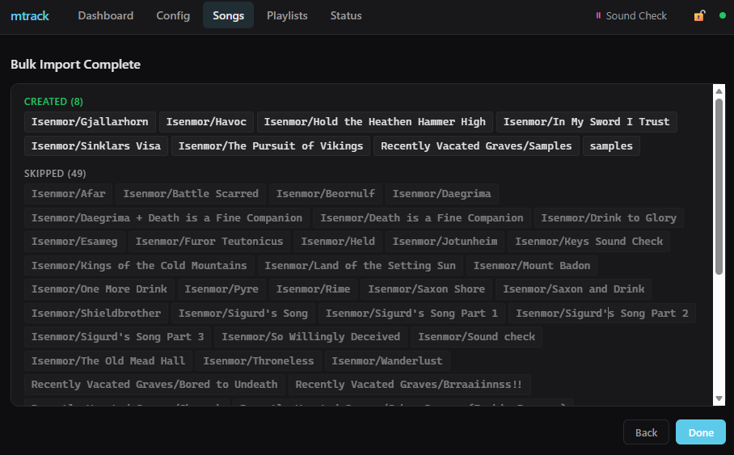
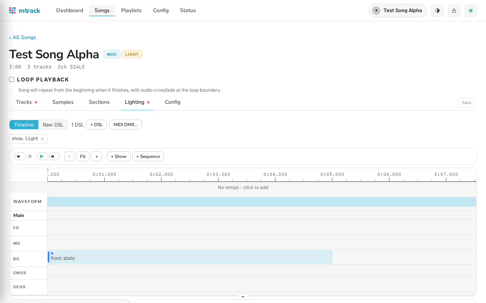
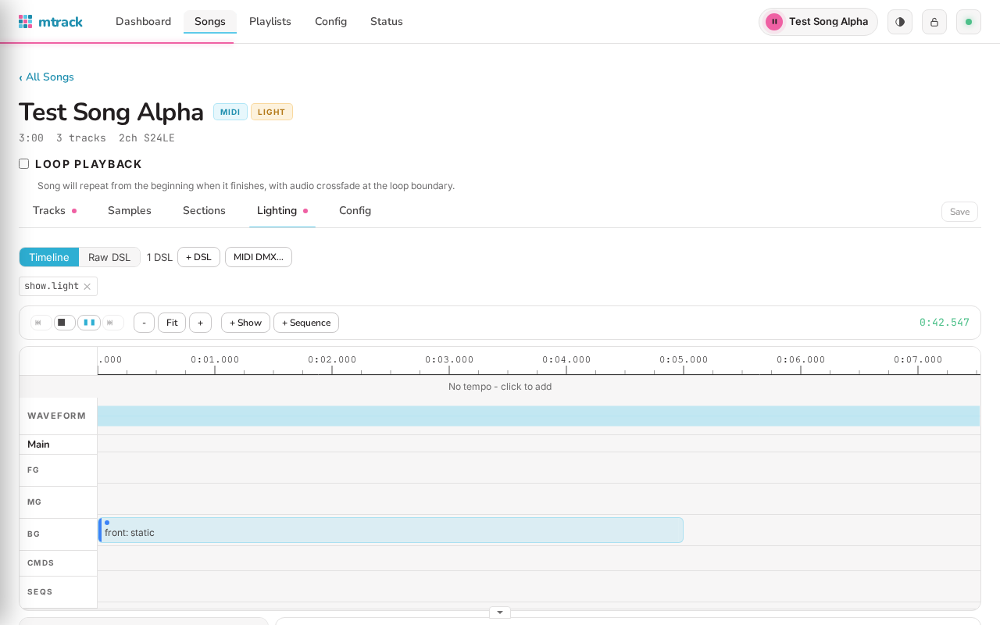
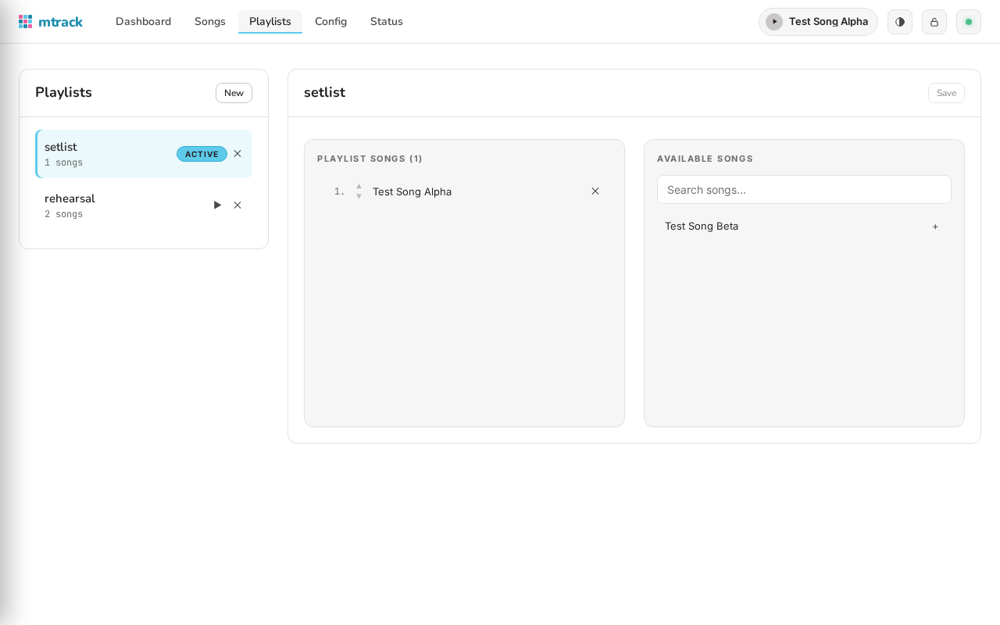
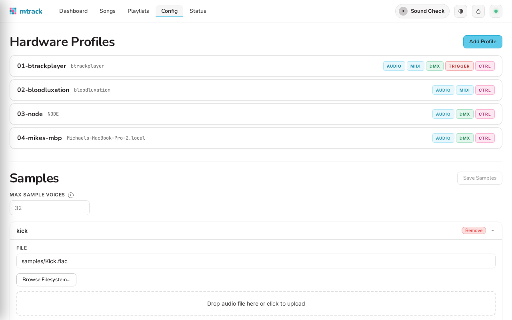
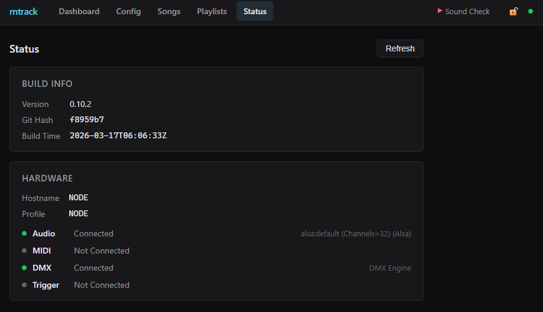

# Web UI

`mtrack` includes a web-based interface for controlling and monitoring the player from a browser.
The web UI is always available when running `mtrack start`, served on all interfaces at
port 8080 by default (`http://0.0.0.0:8080`).

Use `--web-port` and `--web-address` to customize:

```
$ mtrack start /path/to/project --web-port 9090 --web-address 127.0.0.1
```

## Lock Mode

mtrack starts in **locked mode** by default. When locked, all state-altering operations (song
edits, playlist changes, configuration updates, file uploads) are blocked. Playback controls
(play, stop, next, previous, playlist switching) always work regardless of lock state.

Toggle the lock from the lock icon in the navigation bar. This is a safety mechanism for live
performance — lock the player during a show to prevent accidental changes.




## Dashboard

The dashboard is the landing page, providing an at-a-glance view of the player state.



- **Playback card** — Play/stop/next/prev with a progress bar showing elapsed and total time.
  Displays the currently playing song name.
- **Playlist selector** — Dropdown to switch between all available playlists. The current
  playlist's songs are listed below.
- **Waveform** — Per-track waveform peak display for the current song.
- **Stage view** — Interactive canvas showing fixture positions organized by tags (left, right,
  front, back), with real-time RGB color rendering, glow effects, and strobe animation. Drag
  fixtures to rearrange the layout.
- **Active effects** — Lists currently running lighting effects by name.
- **Log panel** — Streaming application logs with auto-scroll.

## Song Browser

The song browser lists all songs in the repository, grouped by directory. Each song shows its
duration, track count, and badges for MIDI, lighting DSL, and MIDI DMX files.



### Creating Songs

Click **New Song** to create a song. Enter a name or path (e.g. `Artist/Song`) — nested
directories are created automatically. The song is created with an empty `song.yaml` that
you can then populate with tracks.

### Importing Songs

Click **Import from Filesystem** to browse the server's filesystem and import existing song
directories.

- **Single import** — Navigate to a directory containing audio files, click "Use This Directory"
  to generate a `song.yaml` from the detected audio, MIDI, and lighting files.
- **Bulk import** — When viewing a directory with subdirectories, click "Import All
  Subdirectories" to import every subdirectory as a song. Subdirectories are scanned
  recursively, so nested structures (artist/album/song) are handled automatically. Directories
  that already have a `song.yaml` are skipped.



### Deleting Songs

Hover over a song and click the X button to remove it from the registry. This only deletes
`song.yaml` — audio, MIDI, and lighting files are preserved. The song is also removed from
any playlists that reference it.

A song that is currently playing cannot be deleted.

## Song Detail

Click a song to open its detail view with four tabs:

### Tracks Tab

Edit track names, assign audio files, and upload new audio files via drag-and-drop or file
picker. When uploading a file that already exists, you'll be prompted to confirm the replacement.

Supported formats: WAV, FLAC, MP3, OGG, AAC, M4A, AIFF.

### MIDI Tab

Configure the MIDI playback file for the song. Pick from existing files in the song directory,
browse the server filesystem, or upload a new `.mid` file.

### Lighting Tab

The lighting tab contains the **timeline editor** — a DAW-style visual editor for authoring
lighting cue shows. See [Timeline Editor](#timeline-editor) below.

### Config Tab

Edit the raw `song.yaml` configuration directly.

### Saving

The **Save** button in the tab bar saves both the song configuration and any lighting file
changes. The button shows "Unsaved" when there are pending changes.

## Timeline Editor

The timeline editor provides a visual interface for creating and editing lighting shows,
with integrated playback preview.



### Layout

- **Toolbar** — Transport controls, zoom, snap-to-grid, and add show/sequence buttons.
- **Time ruler** — Shows absolute timestamps and measure/beat grid (when tempo is defined).
  Click the ruler to set the play cursor position.
- **Waveform lane** — Reference waveform of the song's audio.
- **Show lanes** — Each show has three sub-lanes: Effects, Commands, and Sequences. Cue
  blocks are displayed as colored markers that can be selected, dragged, and edited.
- **Bottom panel** — Stage preview (left) and cue properties editor (right).

### Transport Controls

The toolbar includes a full transport:

| Button | Action |
|--------|--------|
| ⏮ | Skip to start of timeline |
| ■ | Stop playback and reset cursor to start |
| ▶ / ⏸ | Play from cursor / Pause (remembers position) |
| ⏭ | Skip to end of timeline |

**Keyboard shortcuts:**
- **Space** — Toggle play/pause
- **Home** — Skip to start
- **End** — Skip to end

When you press **Play**, mtrack plays the song's audio with synchronized lighting effects.
The green playhead line animates across the timeline and all show lanes, and the stage
preview shows the real-time fixture output. If there are unsaved lighting changes, they
are auto-saved before playback starts.

Pressing **Pause** stops playback and remembers the playhead position — pressing Play again
resumes from that point. Pressing **Stop** resets the cursor to the beginning.



### Stage Preview

The bottom-left panel shows a compact stage visualization with real-time fixture RGB output,
glow effects, strobe animation, and active effect names. Fixtures can be rearranged by
dragging, just like the dashboard stage view.

### Editing Cues

- **Double-click** a lane to create a new cue at that position.
- **Click** a cue block to select it and open its properties in the bottom-right panel.
- **Drag** a cue block to reposition it. When snap-to-grid is enabled, cues snap to
  beat or measure boundaries.
- **Delete** — Select a cue and use the delete button in the properties panel.

### Effect Properties

When a cue is selected, the properties panel shows its effects, commands, and sequences.
Each effect has:

- **Group** — A dropdown populated from the venue's fixture groups, with free-text entry
  for custom groups.
- **Effect type** — Static, cycle, chase, strobe, pulse, dimmer, rainbow.
- **Parameters** — Type-specific controls (colors, speed, frequency, direction, etc.)
  with appropriate dropdowns for constrained values.
- **Layer & blend** — Layer assignment and blend mode for compositing effects.
- **Timing** — Fade up/hold/down times.

### Zoom and Navigation

- **+/- buttons** or **Ctrl+scroll** to zoom in/out. The view anchors on the center
  (toolbar buttons) or the mouse position (scroll wheel).
- **Click and drag** the ruler to pan.
- **Fit** button to fit the entire timeline in view.
- **Snap** toggle with beat or measure resolution when tempo is defined.

### Sequences

Click **+ Sequence** in the toolbar to create a reusable cue sequence. Sequences appear
as chips in the detail area and can be edited in a modal with its own timeline. Reference
sequences from show cues to reuse patterns.

### Raw DSL Tab

Switch to the **Raw DSL** tab to edit the lighting DSL text directly. A **Validate** button
checks the syntax without saving. Switching back to the Timeline tab re-parses the DSL.

## Playlist Editor

The playlist editor provides a left panel for browsing, creating, and deleting playlists,
and a right panel for editing song order (reorder, add, remove) with a searchable
available-songs list.



Playlists are stored as individual YAML files in the `playlists/` directory. The `all_songs`
playlist is always present and auto-generated from the song repository.

Use the **Activate** button to switch the player to a playlist. This can also be done from
the dashboard's playlist dropdown.

## Configuration Editor

The config editor provides a profile-based hardware configuration UI with tabs for:

- **Audio** — Device selection, sample rate, format, buffer size, track mappings
- **MIDI** — Device selection, beat clock
- **DMX** — OLA host/port, universe mappings
- **Lighting** — Fixture types, venues, profile settings with constraint editors
- **Triggers** — Audio and MIDI trigger inputs with calibration
- **Controllers** — gRPC and OSC controller configuration



Changes are saved with optimistic concurrency (checksums) and trigger automatic hardware
reinitialization.

## Status Page

The status page shows build information and hardware subsystem status:

- **Audio, MIDI, DMX, Trigger** — Each shows "connected", "initializing", or "not connected"
  with the device name when connected.
- **Profile** — The matched hostname and active profile name.



## Connection Indicator

The navigation bar includes a connection status dot (green = connected, red = disconnected)
and will auto-reconnect if the WebSocket connection drops. The lighting editor shows a
yellow warning banner when disconnected.

## Directory Structure Requirements

The web UI's management features (song editing, file uploads, lighting file editing, playlist
management, bulk import) expect all project files to live under a single project root directory
— the directory containing `mtrack.yaml`. All file paths in the UI are resolved relative to
this root, and path traversal outside it is blocked.

If your `mtrack.yaml` references files outside the project root (e.g. absolute paths to songs
on a different mount, or a `songs` directory on a separate drive), the web UI will not be able
to manage those files. Songs discovered from external paths will appear in the song list and
play correctly, but editing, uploading, and lighting file management will only work for files
under the project root.

mtrack must have **write access** to the project root and its contents for management features
to work. Read-only filesystems will allow playback but not song creation, file uploads, or
configuration changes from the web UI.

## REST API

The web UI exposes a comprehensive REST API for all management operations. Playback control
uses gRPC-Web (PlayerService). Real-time state streaming uses WebSocket (`/ws`).

All mutating REST endpoints are blocked when the player is in lock mode, returning
HTTP 423 (Locked). Read endpoints, playback control, playlist activation, and validation
endpoints always work.
