# Web UI

`mtrack` includes a web-based interface for controlling and monitoring the player from a browser.
The web UI is always available when running `mtrack start`, served on all interfaces at
port 8080 by default (`http://0.0.0.0:8080`).

Use `--web-port` and `--web-address` to customize:

```
$ mtrack start /path/to/project --web-port 9090 --web-address 127.0.0.1
```

The UI is fully responsive — desktop layout above 720px, phone layout (slide-in drawer + sticky
mini-player) below — and supports both light and dark themes. Click the sun / moon button in
the top nav to cycle through **system → light → dark → system**; the choice is persisted to
`localStorage`.

## Lock Mode

mtrack starts in **locked mode** by default. When locked, all state-altering operations (song
edits, playlist changes, configuration updates, file uploads) are blocked. Save and delete
buttons across every editor become visibly disabled, with a tooltip explaining why. Playback
controls (play, stop, next, previous, playlist switching) always work regardless of lock state.

Toggle the lock from the lock icon in the top nav (or, on phone, from the mini-player). When
locked, a thin amber **LIVE — locked** stripe surfaces under the top nav as a constant
reminder. Unlocking from the topnav requires a confirmation dialog ("Unlock during a live
session?") so you can't fat-finger your way out of safe mode mid-show; locking is still one
click.


## Connection & Health Indicator

The dot at the right edge of the top nav reflects the worst-case state of all required
subsystems, polled every 5 seconds:

- **Green** — All required subsystems are connected.
- **Amber** — Something is initializing, or a controller is in error.
- **Red** — A required subsystem is not connected. Audio is always required; MIDI / DMX are
  required when the active profile has them configured.
- **Pulsing red** — The WebSocket connection itself is down. The lighting editor also shows a
  yellow warning banner in this state.

Click the dot to jump to the [Status page](#status-page) for details and one-click "Configure →"
or "Fix →" actions on subsystems that need attention.

A 2px pink fill at the bottom edge of the top nav reflects elapsed/total playback position
while a song is playing, so you can tell where you are in the song without leaving the page
you're working on.

## Unsaved-Changes Guard

When you have unsaved edits in the Songs detail, Config, Playlists, or Lighting editors, the
**Save** button shifts to a primary (cyan) treatment with an "Unsaved" pill next to it.
Clicking a top-nav link or the back-link with unsaved changes triggers a "Discard unsaved
changes?" confirmation; cancel restores the URL and your edits stay intact. Tab navigation
within the same editor (e.g. switching between Songs detail tabs) keeps the same component
mounted and does not prompt — your edits across tabs persist.

## Dashboard

The dashboard is the landing page, providing an at-a-glance view of the player state.

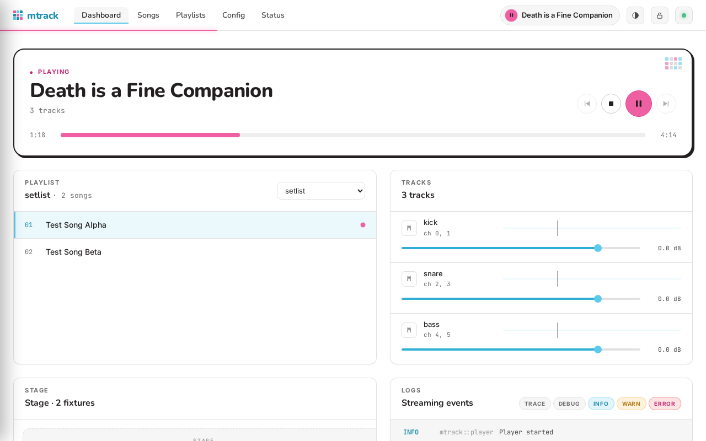

- **Playback card** — Play/stop/next/prev with a progress bar showing elapsed and total time.
  Displays the currently playing song name. The progress bar is clickable: click anywhere to
  seek — while playing everything (audio, MIDI, lighting) restarts in sync at that position;
  while stopped the position is remembered and used by the next Play (shown as a marker on the
  bar). When a song has defined sections, section chips appear — tinted with the section's
  color from the editor: clicking a section name seeks
  to its start, and the small loop button next to it arms a section loop. An active loop shows
  the section name and a "Stop Loop" button. Beat/measure position is displayed when beat grid
  data is available, along with a visual metronome: one dot per beat of the current meter with
  the active beat highlighted, and a pulse that flashes on every beat while playing. When the
  song's metronome defines [accent levels](#metronome-feel), the dots and the pulse follow
  them — accents emphasized, half accents in amber, silent beats hollow and unflashed —
  otherwise the downbeat is accented. Pilot hints appear as markers on the progress bar, and
  upcoming hint labels are shown a few seconds ahead of their position. Hints that follow each other closely
  (e.g. a "bridge" label and its "3..2..1" countdown) stay visible together, with only the
  live one highlighted — while its sample plays, or briefly at the anchor for label-only
  hints.
- **Playlist selector** — Dropdown to switch between all available playlists. The current
  playlist's songs are listed below. Songs are clickable to jump directly to a song during
  playback.
- **Waveform** — Per-track waveform peak display for the current song, rendered with DPR
  scaling for crisp display on HiDPI/Retina screens. Each track row also has a gain slider
  (double-click resets to 0 dB) and an **M** mute button. Muting silences the track
  immediately without touching the fader value, so unmuting restores the exact gain you
  had — mute state is runtime-only and resets on player restart.
- **Stage view** — Interactive canvas showing fixture positions organized by tags (left, right,
  front, back), with real-time RGB color rendering, glow effects, and strobe animation. Drag
  fixtures to rearrange the layout — positions persist in localStorage across page reloads.
- **Active effects** — Lists currently running lighting effects by name.
- **Log panel** — Streaming application logs with level filter pills
  (TRACE/DEBUG/INFO/WARN/ERROR), defaulting to INFO+. ERROR rows get a pink-tinted
  background and a left-edge stripe; WARN rows get the same treatment in amber, so they're
  hard to miss while scanning during a show.

## Song Browser

The song browser lists all songs in the repository, grouped by directory. Each song shows its
duration, track count, and badges for MIDI, lighting DSL, and MIDI DMX files. The currently
loaded song is marked with a pink left-edge stripe and a **Playing** or **Loaded** badge so
you can spot it at a glance while scrolling a long song list.

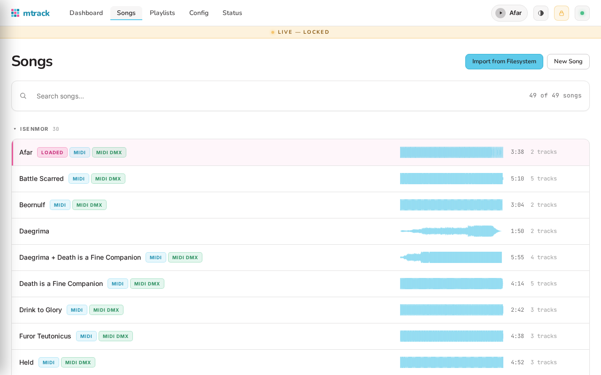

### Creating Songs

Click **New Song** to create a song. Enter a name or path (e.g. `Artist/Song`) — nested
directories are created automatically. The song is created with an empty `song.yaml` that
you can then populate with tracks.

### Importing Songs

Click **Import from Filesystem** to browse the server's filesystem and import existing song
directories.

- **Single import** — Navigate to a directory containing audio files, click "Use This Directory"
  to generate a `song.yaml` from the detected audio, MIDI, and lighting files.
- **Bulk import** — When viewing a directory with subdirectories, click "Import All
  Subdirectories" to import every subdirectory as a song. Subdirectories are scanned
  recursively, so nested structures (artist/album/song) are handled automatically. Directories
  that already have a `song.yaml` are skipped.

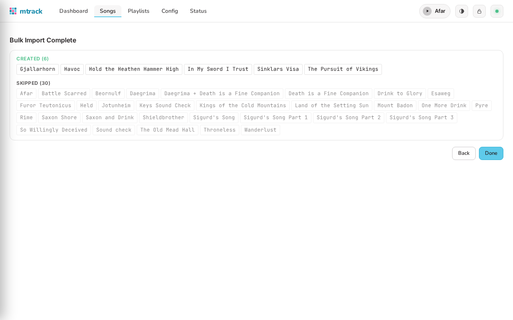

### Deleting Songs

Hover over a song and click the X button to remove it from the registry. This only deletes
`song.yaml` — audio, MIDI, and lighting files are preserved. The song is also removed from
any playlists that reference it.

A song that is currently playing cannot be deleted.

## Song Detail

Click a song to open its detail view with five tabs:

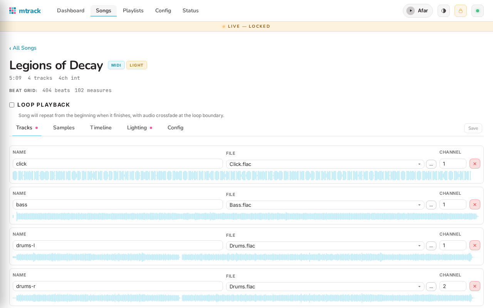

### Tracks Tab

Edit track names, assign audio files, and upload new audio files via drag-and-drop or file
picker. When uploading a file that already exists, you'll be prompted to confirm the replacement.
The MIDI playback file is also configured here — pick from existing files, browse the server
filesystem, or upload a new `.mid` file. When a MIDI file is configured, a 16-channel toggle
grid lets you exclude specific channels from playback. Three preset chips above the grid —
**None / All / Drums only** — cover the common cases; "Drums only" excludes every channel
except 10 (the General MIDI drum channel) for the live-show pattern of mtrack running drums
while the band plays everything else.

Supported audio formats: WAV, FLAC, MP3, OGG, AAC, M4A, AIFF.

### Timeline Tab

Named "Sections" until it grew tempo and pilot lanes, this is a canvas-based visual editor
for the song's timeline: sections (e.g., verse, chorus, bridge).
The timeline displays all track waveforms and beat grid measure lines. Sections can be:

- **Created** by dragging on empty space (snaps to measure boundaries)
- **Resized** by dragging edges
- **Moved** by dragging the body
- **Edited** by tapping a section, which opens its dialog
- **Deleted** from that dialog, or with the Delete key

Zoom controls include +/-, Fit, and Ctrl+scroll wheel with anchor-point zooming. Measure label
density and snap granularity adapt to zoom level.

The lanes below the timeline are the song's tracks. Generated ones are drawn too: the
metronome's click and the pilot cues are rendered from the same config the player synthesizes
them from, so a glance says whether a cue lands where you meant it to, without playing
anything. They are computed per request rather than cached, and the editor refetches after a
save, so they follow tempo and feel edits immediately.

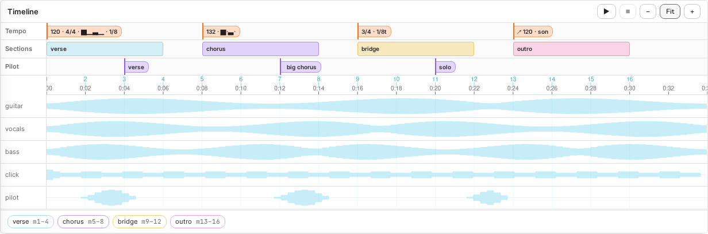

Sections are used for [section looping](#section-looping) during playback.

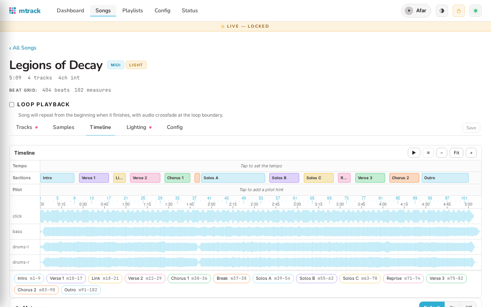

#### The section dialog

Tapping a section opens a bottom sheet with everything drag editing cannot do precisely on a
phone: its name, its position (a start-measure stepper that slides the whole section keeping
its length, and a length stepper clamped to the song), and its color. Colors come from a
palette — new sections rotate through it automatically — and are stored as `sections[].color`
in `song.yaml`.

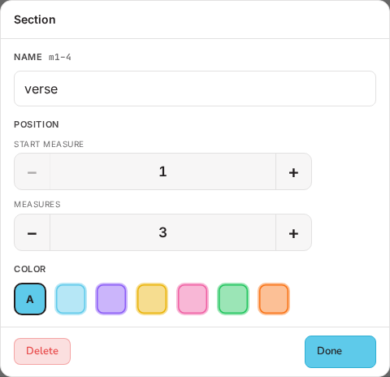

The color follows the section out of the editor: the player's section chips are tinted to
match, so the part you are in is recognisable at a glance from across a stage.

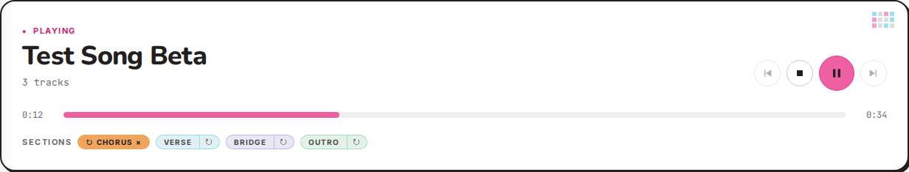

#### Preview transport and the playhead

When the song being edited is the one loaded in the player, the editor grows a playhead — a
draggable line across every lane — plus play/pause and stop buttons and a readout of the
musical position, time, BPM and meter under it. Drag the line to seek, or use the arrow keys
for five-second jumps. Auditioning a boundary no longer means switching to the player and back.

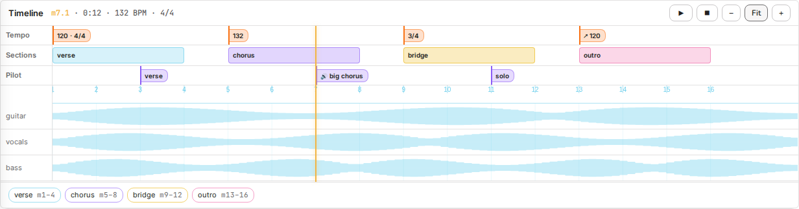

#### Metronome

Under the timeline, the song's metronome panel routes and shapes its click. The tri-state at
the top — **Default / On / Off** — decides whether the song follows the player-wide default
(see [the config editor](#configuration-editor)) or overrides it, which is `enabled` in the
song's `metronome:` block: absent to follow, `true` or `false` to override.

Below it: the track name the click is routed to, a click volume that trims this song against
the rest, presets, and the four click sounds. A sound left unchecked is _inherited from player
defaults_ rather than silenced — so a song only carries what it actually changes. Accents and
subdivisions are not here; they live on the tempo markers, since they change mid-song.

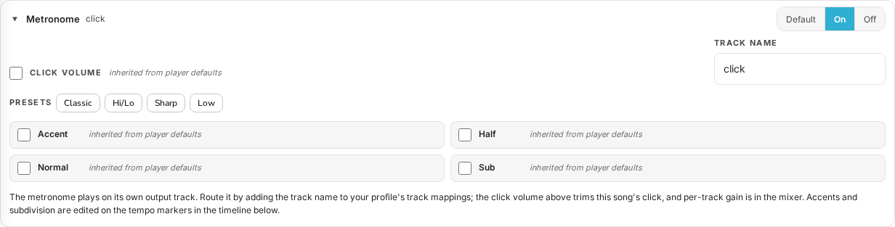

#### Tempo and pilot layers

Above the section lane the timeline shows two DAW-style marker layers, so the song's tempo map
and pilot voice-hints can be authored against the same beat grid:

- **Tempo layer** — one marker per tempo event (the starting `bpm`/`time_signature` plus each
  `change`). Clicking a marker opens the **tempo change** dialog to edit the measure/beat
  position, BPM (with a Tap helper), time signature, and an optional transition (snap, or ramp
  over a number of beats/measures). Clicking empty space adds a change at that measure.
- **Pilot layer** — one marker per voice hint. Clicking a marker opens the **pilot hint** dialog
  to edit the label, the measure/beat (or absolute time) position, and an optional audio clip;
  a hint with no clip is a visual cue only. Adjacent hints group together when their display
  windows overlap.

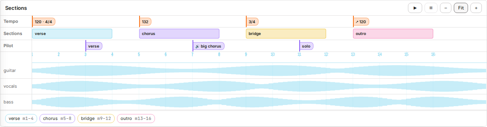

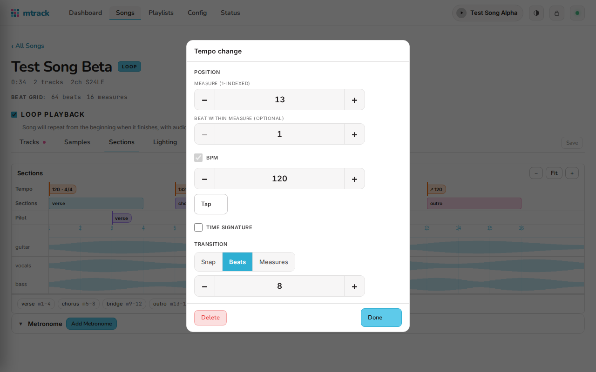

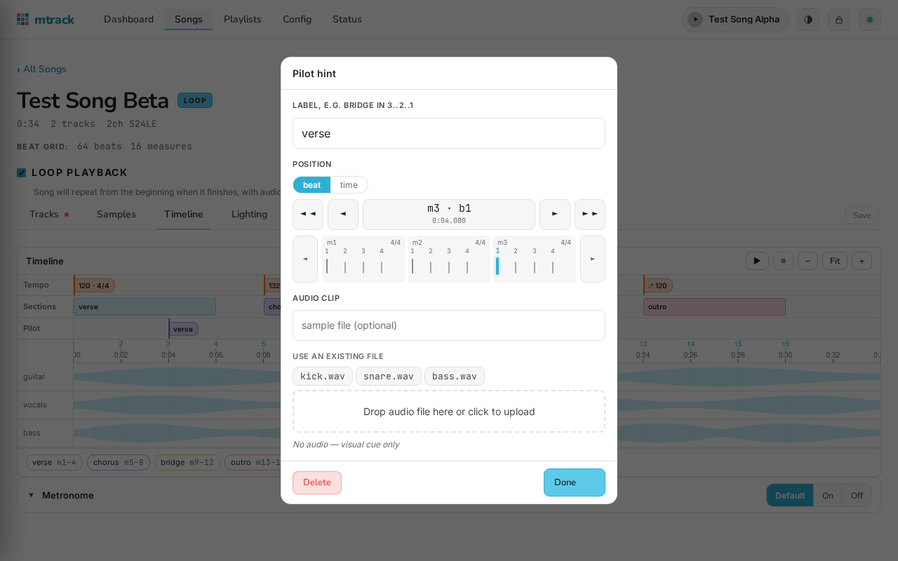

#### Metronome feel

Tempo markers also carry the metronome's _feel_ — the accent pattern and the subdivision in
effect from that measure on. The base marker edits the song-level values; any later marker can
change either one, on its own or alongside a tempo change. Each marker's chip labels what it
changes, with the accent pattern drawn as a per-beat glyph and the subdivision as its note value
(`1/8`, `1/8t`, `son`, …).

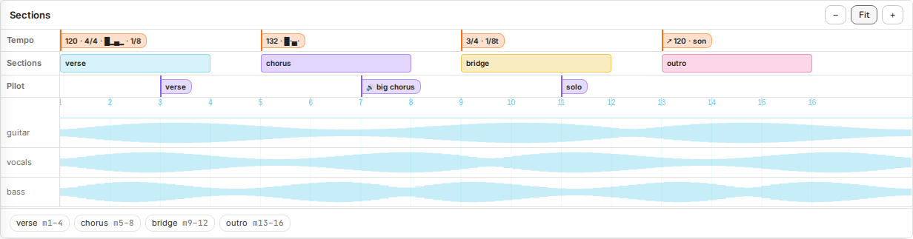

The dialog's accents and subdivision sections are individually toggleable. **Accents** are tapped
per beat, each tap cycling that beat one step — silent, normal, half accent, accent. **Subdivision**
is picked from note values relative to the meter's beat (in 4/4: quarter, eighths, triplets,
sixteenths, sextuplets), plus the son and rumba claves, which play their hit pattern over a
two-measure cycle.

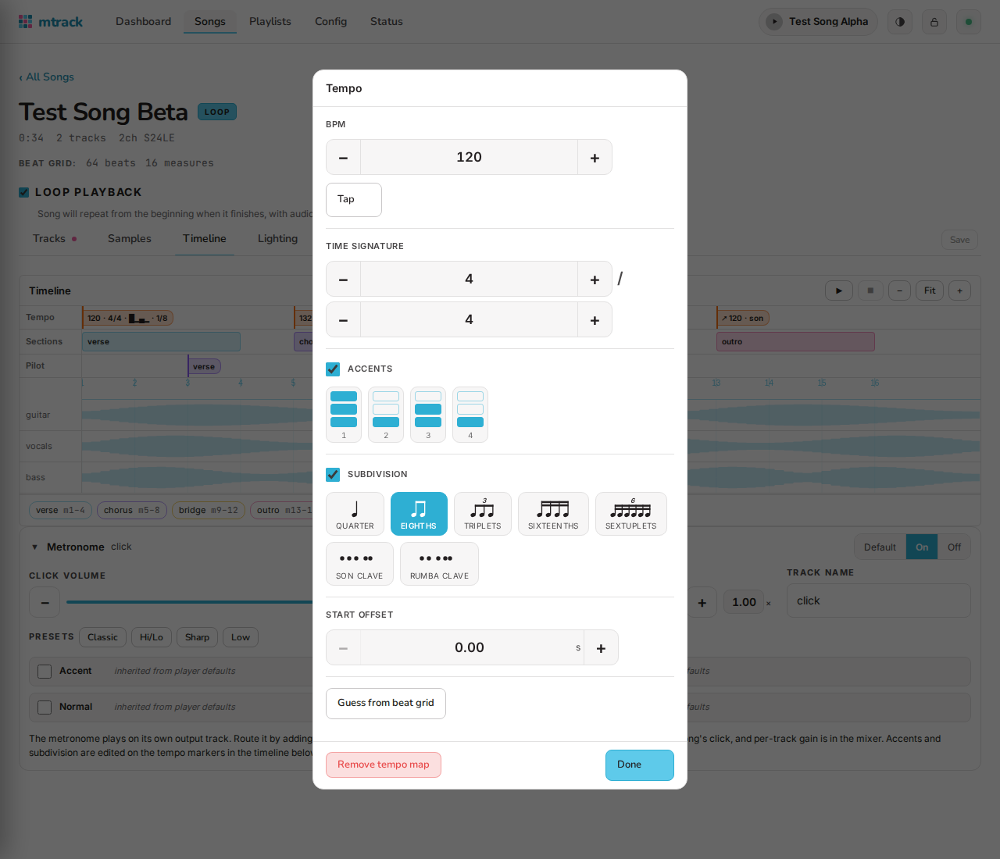

A change marker shows only the aspects it overrides; here a tempo change with an 8-beat transition
that also switches the feel to a son clave.

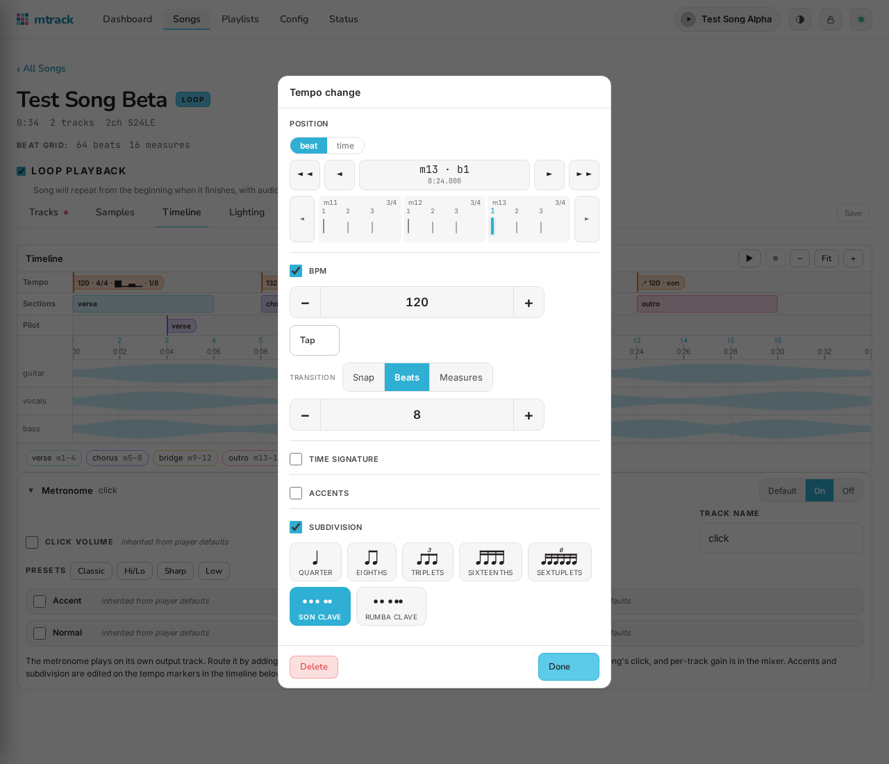

While playing, the visual metronome on the [dashboard](#dashboard) mirrors the resolved
levels, so what you see matches what the click plays.


### Lighting Tab

The lighting tab contains the **timeline editor** — a DAW-style visual editor for authoring
lighting cue shows. See [Timeline Editor](#timeline-editor) below.

Light show files (`.light`) can be added and removed directly from this tab. Adding or removing
files is deferred until Save, so navigating away without saving leaves the disk untouched.

### Config Tab

Edit the raw `song.yaml` configuration directly. Song-specific notification audio overrides
are also configured here — these let you override profile-level notification sounds for
individual songs, with section names autocompleting from the song's defined sections.

### Saving

The **Save** button in the tab bar saves both the song configuration and any lighting file
changes. The button shows "Unsaved" when there are pending changes. Ctrl+S / Cmd+S keyboard
shortcut is also supported.

## Timeline Editor

The timeline editor provides a visual interface for creating and editing lighting shows,
with integrated playback preview.

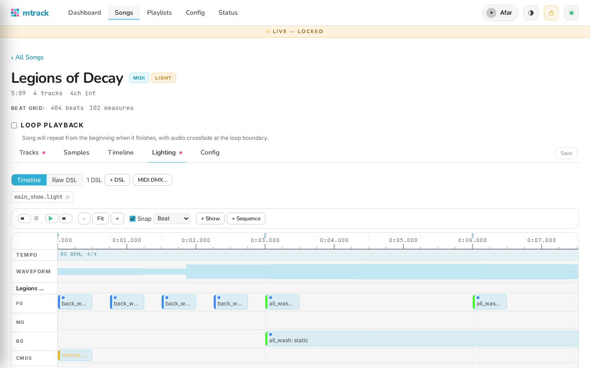

### Layout

- **Toolbar** — Transport controls, zoom, snap-to-grid, and add show/sequence buttons.
- **Time ruler** — Shows absolute timestamps and measure/beat grid (when tempo is defined).
  Click the ruler to set the play cursor position.
- **Waveform lane** — Reference waveform of the song's audio.
- **Show lanes** — Each show has three layer lanes (Foreground, Midground, Background) plus
  Commands and Sequences lanes. Effect blocks display their actual duration as block width and
  can be resized by dragging a right-edge handle. Sequence references are expanded inline,
  showing each iteration's effects at their correct timeline positions (visually distinct with
  dashed borders and pink tint).
- **Bottom panel** — Stage preview (left) and cue properties editor (right). The bottom panel
  is collapsible with a toggle button.

### Transport Controls

The toolbar includes a full transport:

| Button | Action                                        |
| ------ | --------------------------------------------- |
| ⏮     | Skip to start of timeline                     |
| ■      | Stop playback and reset cursor to start       |
| ▶ / ⏸  | Play from cursor / Pause (remembers position) |
| ⏭     | Skip to end of timeline                       |

**Keyboard shortcuts:**

- **Space** — Toggle play/pause
- **Home** — Skip to start
- **End** — Skip to end

When you press **Play**, mtrack plays the song's audio with synchronized lighting effects.
The green playhead line animates across the timeline and all show lanes, and the stage
preview shows the real-time fixture output. If there are unsaved lighting changes, they
are auto-saved before playback starts.

Pressing **Pause** stops playback and remembers the playhead position — pressing Play again
resumes from that point. Pressing **Stop** resets the cursor to the beginning.

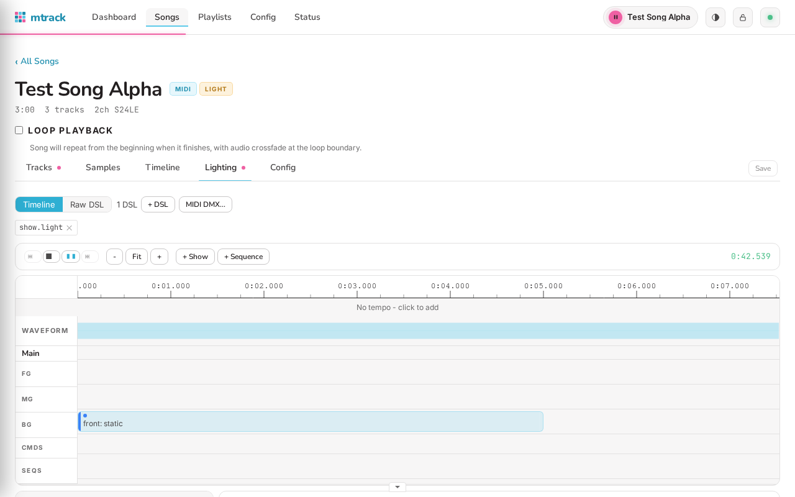

### Stage Preview

The bottom-left panel shows a compact stage visualization with real-time fixture RGB output,
glow effects, strobe animation, and active effect names. Fixtures can be rearranged by
dragging, just like the dashboard stage view.

### Editing Cues

- **Double-click** a layer lane (foreground/midground/background) to create a new effect
  at that position, assigned to the correct layer with a default `1measure` duration
  (when tempo is available).
- **Click** a cue block to select it and open its properties in the bottom-right panel.
- **Drag** a cue block to reposition it. When snap-to-grid is enabled, cues snap to
  beat or measure boundaries.
- **Resize** — Drag the right edge of an effect block to change its duration. Resizing
  snaps to the nearest beat or measure boundary (matching the snap resolution setting).
  Hold Ctrl/Cmd while releasing to bypass snap for free-form sizing. Durations prefer
  measure/beat units (e.g. `1measure`, `2beats`) when aligned to the tempo grid.
- **Delete** — Select a cue and use the delete button in the properties panel.

### Effect Properties

When a cue is selected, the properties panel shows its effects, commands, and sequences.
Each effect has:

- **Group** — A dropdown populated from the venue's fixture groups, with free-text entry
  for custom groups.
- **Effect type** — Static, cycle, chase, strobe, pulse, dimmer, rainbow.
- **Parameters** — Type-specific controls (colors, speed, frequency, direction, etc.)
  with appropriate dropdowns for constrained values.
- **Layer & blend** — Layer assignment and blend mode for compositing effects.
- **Timing** — Fade up/hold/down times.

### Zoom and Navigation

- **+/- buttons** or **Ctrl+scroll** to zoom in/out. The view anchors on the center
  (toolbar buttons) or the mouse position (scroll wheel).
- **Click and drag** the ruler to pan.
- **Fit** button to fit the entire timeline in view.
- **Snap** toggle with beat, measure, or subdivision resolution (1/2, 1/4, 1/8, 1/16 beat)
  when tempo is defined.

### Tempo Detection

The tempo lane in the timeline shows the song's tempo map. Clicking it opens the tempo editor
with controls for BPM, time signature, start offset, and tempo changes.

- **Detect from MIDI** — When the song has a MIDI file, the editor can extract an authoritative
  tempo map directly from MIDI `SetTempo` and `TimeSignature` meta events. Consecutive
  monotonic BPM changes (ritardandos/accelerandos) are automatically collapsed. If the
  MIDI-predicted beat positions don't align well with click-track detections (RMSE > 15ms),
  a warning badge indicates the MIDI file may not match the recording.
- **Guess from beat grid** — When no MIDI file is available but the song has a click track,
  the editor can estimate a tempo map from the detected beat grid. Results are displayed with
  an "estimated from beat grid" badge.

### Sequences

Click **+ Sequence** in the toolbar to create a reusable cue sequence. Sequences appear
as chips in the detail area and can be edited in a modal with its own timeline. Reference
sequences from show cues to reuse patterns.

### Raw DSL Tab

Switch to the **Raw DSL** tab to edit the lighting DSL text directly. A **Validate** button
checks the syntax without saving. Switching back to the Timeline tab re-parses the DSL.

## Playlist Editor

The playlist editor provides a left panel for browsing, creating, and deleting playlists,
and a right panel for editing song order (reorder, add, remove) with a searchable
available-songs list.

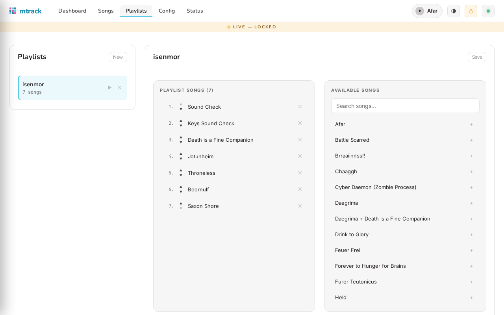

Playlists are stored as individual YAML files in the `playlists/` directory. The `all_songs`
playlist is always present and auto-generated from the song repository.

Use the **Activate** button to switch the player to a playlist. This can also be done from
the dashboard's playlist dropdown.

## Configuration Editor

The config editor provides a profile-based hardware configuration UI with tabs for:

- **Audio** — Device selection, sample rate, format, buffer size, track mappings
- **MIDI** — Device selection, beat clock, MIDI-to-DMX passthrough mappings with Note Mapper
  and CC Mapper transformer editors
- **DMX** — OLA host/port, universe mappings
- **Lighting** — Fixture types, venues, profile settings with constraint editors
- **Triggers** — Audio and MIDI trigger inputs with calibration
- **Controllers** — gRPC, OSC, and MIDI controller configuration. The MIDI controller section
  supports full editing of event mappings (play, prev, next, stop, all_songs, playlist) with
  optional section_ack and stop_section_loop events, plus Morningstar preset naming integration
- **Status Events** — MIDI events emitted on player state changes (off/idling/playing) for
  hardware LED feedback
- **Notifications** — Custom audio files for loop armed, break requested, loop exited, and
  section entering events, plus per-section-name overrides
- **Metronome defaults** — the click sounds every song starts from, and whether the click is
  on by default

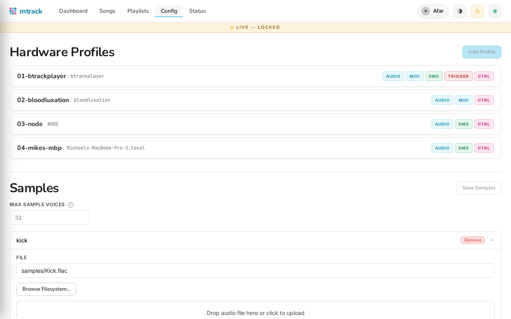

Click a profile to open its settings with tabs for each subsystem:

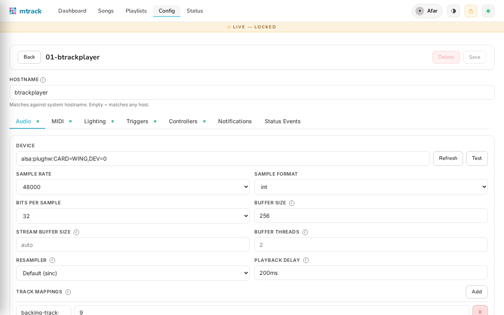

Changes are saved with optimistic concurrency (checksums) and trigger automatic hardware
reinitialization.

### Metronome defaults

With a dozen songs, click sounds are a player decision rather than a per-song one. The
Metronome section edits the `metronome:` block of `mtrack.yaml`: the four click roles
(accent, half, normal, sub) with volume, frequency and an optional sample file each, four
presets to start from, and a checkbox that turns the click on by default for every song with
a tempo map. Each sound previews in the browser — the speaker button synthesizes the same
envelope the player uses, so you can audition without routing audio.

Songs inherit all of it and override only what they set; see
[the song's metronome panel](#metronome).

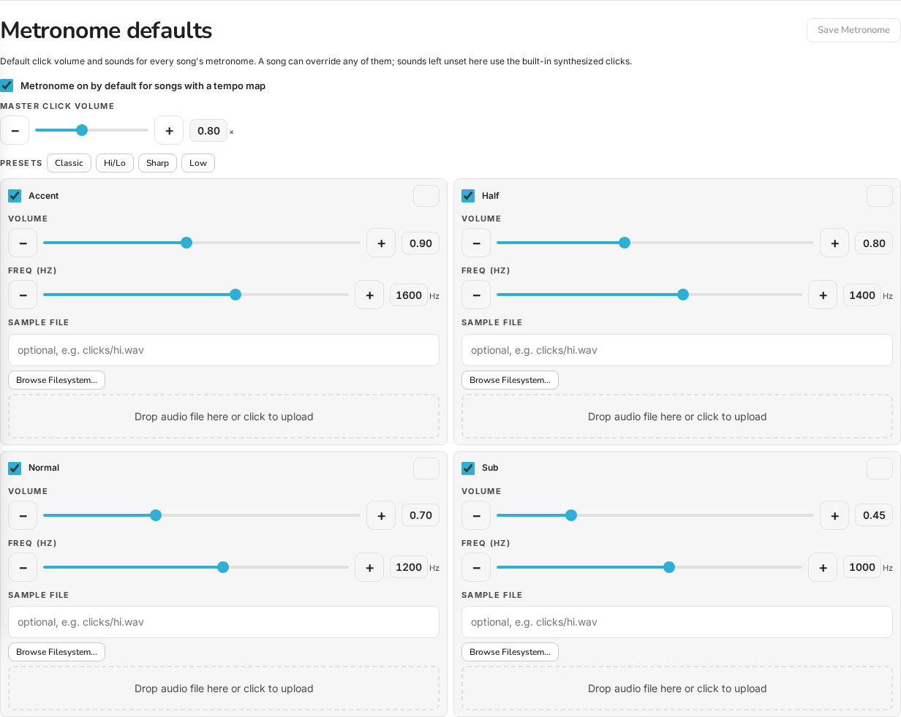

## Song Looping

mtrack supports two levels of looping:

### Whole-Song Looping

Songs with `loop_playback: true` in their `song.yaml` loop indefinitely. Audio crossfades
seamlessly at loop boundaries (100ms linear fade), MIDI restarts from the beginning, and
lighting/DMX timelines reset cleanly. During a looping song, pressing Play or Next breaks out
of the loop, advances the playlist, and auto-plays the next song.

### Section Looping

Named sections (defined by measure ranges in the Timeline tab or `song.yaml`) can be looped
during playback. Activate a section loop from the dashboard's section buttons, or via gRPC
(`LoopSection`/`StopSectionLoop`) or MIDI controller events (`section_ack`, `stop_section_loop`).

When a section loop is active:

- Audio crossfades at section boundaries (100ms linear fade)
- MIDI restarts from the section start with hard cut
- DMX/lighting timelines reset to the section's start time
- A confirmation tone plays through the `mtrack:looping` track mapping
- Next/Prev navigation is allowed during looping

Section activation is rejected if playback has already passed the section end.

## Status Page

The status page shows build information and hardware subsystem status in a two-column grid
layout:

- **Audio, MIDI, DMX, Trigger** — Each shows "connected", "initializing", "not connected",
  or "not configured" with the device name when connected. Subsystems that aren't currently
  connected get a **Configure →** or **Fix →** pill that deep-links to the relevant section
  in the config editor for the active profile.
- **Controllers** — Per-controller status (running / error) with a Restart button.
- **Profile** — The matched hostname and active profile name.

The page auto-refreshes every 5 seconds with an "Updated Xs ago" indicator. The top nav
health dot reflects the worst-case state of all required subsystems on this page (see
[Connection & Health Indicator](#connection--health-indicator)).

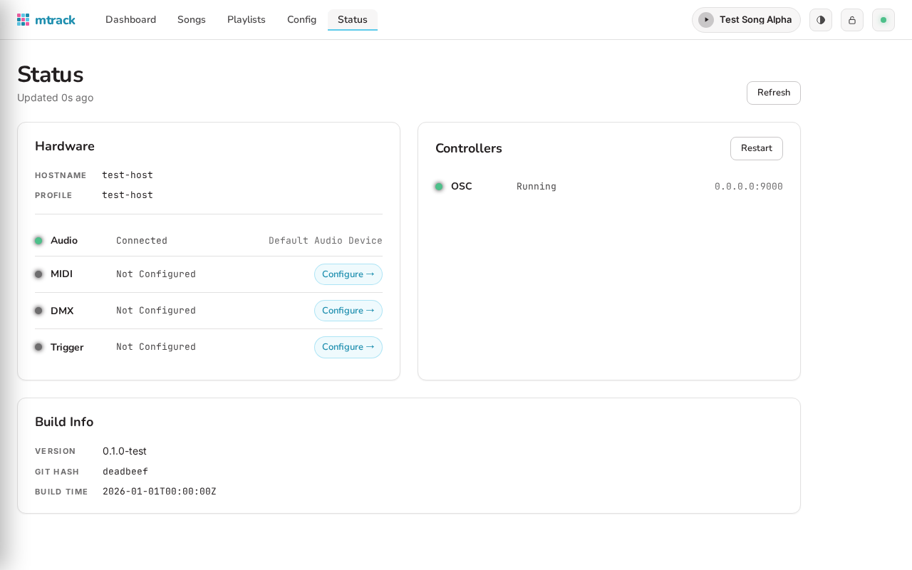

## Phone Layout

Below 720px viewport width, the UI swaps in phone-friendly chrome:

- The top nav's tabs collapse behind a **hamburger drawer** (slide-in from the left, 280px
  wide). Tab and Shift-Tab cycle focus inside the drawer; Esc and a backdrop click close it.
- A sticky bottom **mini-player** with prev / play / next, a song title that taps through to
  the Dashboard, and a lock toggle stays visible across all pages.
- The Songs detail tab bar scrolls horizontally with a fade on the right edge; the MIDI
  channel grid reflows from 16-up to 8-up; and the Lighting tab swaps the timeline editor
  (which needs at least ~1000px to be usable) for a read-only summary listing tempo, show
  and sequence cue counts, and the distinct effect types in the song.
- Editing the Lighting timeline is desktop-only by design. Use a laptop or tablet in
  landscape for cue authoring.

## Directory Structure Requirements

The web UI's management features (song editing, file uploads, lighting file editing, playlist
management, bulk import) expect all project files to live under a single project root directory
— the directory containing `mtrack.yaml`. All file paths in the UI are resolved relative to
this root, and path traversal outside it is blocked.

If your `mtrack.yaml` references files outside the project root (e.g. absolute paths to songs
on a different mount, or a `songs` directory on a separate drive), the web UI will not be able
to manage those files. Songs discovered from external paths will appear in the song list and
play correctly, but editing, uploading, and lighting file management will only work for files
under the project root.

mtrack must have **write access** to the project root and its contents for management features
to work. Read-only filesystems will allow playback but not song creation, file uploads, or
configuration changes from the web UI.

## REST API

The web UI exposes a comprehensive REST API for all management operations. Playback control
uses gRPC-Web (PlayerService). Real-time state streaming uses WebSocket (`/ws`).

All mutating REST endpoints are blocked when the player is in lock mode, returning
HTTP 423 (Locked). Read endpoints, playback control, playlist activation, and validation
endpoints always work.
