# Web UI

`mtrack` includes a web-based interface for controlling and monitoring the player from a browser.
The web UI is always available when running `mtrack start`, served on all interfaces at
port 8080 by default (`http://0.0.0.0:8080`).

Use `--web-port` and `--web-address` to customize:

```
$ mtrack start /path/to/project --web-port 9090 --web-address 127.0.0.1
```

The UI is fully responsive — desktop layout above 720px, phone layout (slide-in drawer + sticky
mini-player) below — and supports both light and dark themes. Click the sun / moon button in
the top nav to cycle through **system → light → dark → system**; the choice is persisted to
`localStorage`.

## Lock Mode

mtrack starts in **locked mode** by default. When locked, all state-altering operations (song
edits, playlist changes, configuration updates, file uploads) are blocked. Save and delete
buttons across every editor become visibly disabled, with a tooltip explaining why. Playback
controls (play, stop, next, previous, playlist switching) always work regardless of lock state.

Toggle the lock from the lock icon in the top nav (or, on phone, from the mini-player). When
locked, a thin amber **LIVE — locked** stripe surfaces under the top nav as a constant
reminder. Unlocking from the topnav requires a confirmation dialog ("Unlock during a live
session?") so you can't fat-finger your way out of safe mode mid-show; locking is still one
click.

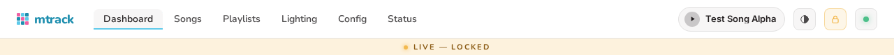

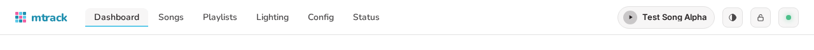

## Connection & Health Indicator

The dot at the right edge of the top nav reflects the worst-case state of all required
subsystems, polled every 5 seconds:

- **Green** — All required subsystems are connected.
- **Amber** — Something is initializing, or a controller is in error.
- **Red** — A required subsystem is not connected. Audio is always required; MIDI / DMX are
  required when the active profile has them configured. The current venue not loading is red
  too, and puts a banner on every page (see
  [When a venue does not load](../lighting/configuration.md#when-a-venue-does-not-load)).
- **Pulsing red** — The WebSocket connection itself is down. The lighting editor also shows a
  yellow warning banner in this state.

Click the dot to jump to the [Status page](#status-page) for details and one-click "Configure →"
or "Fix →" actions on subsystems that need attention.

A 2px pink fill at the bottom edge of the top nav reflects elapsed/total playback position
while a song is playing, so you can tell where you are in the song without leaving the page
you're working on.

## Unsaved-Changes Guard

When you have unsaved edits in the Songs detail, Config, Playlists, or Lighting editors, the
**Save** button shifts to a primary (cyan) treatment with an "Unsaved" pill next to it.
Clicking a top-nav link or the back-link with unsaved changes triggers a "Discard unsaved
changes?" confirmation; cancel restores the URL and your edits stay intact. Tab navigation
within the same editor (e.g. switching between Songs detail tabs) keeps the same component
mounted and does not prompt — your edits across tabs persist.

## Dashboard

The dashboard is the landing page, providing an at-a-glance view of the player state.

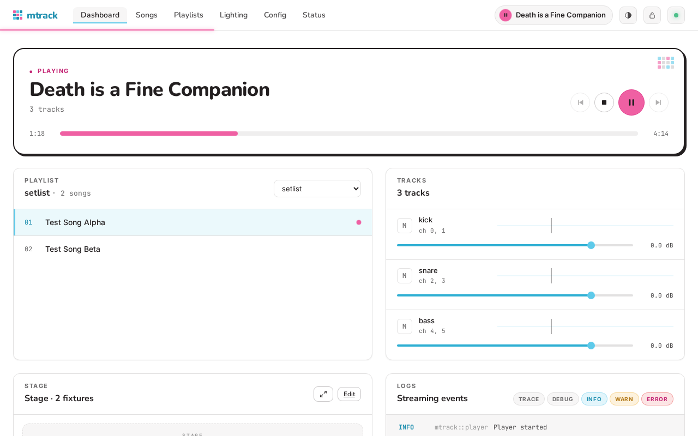

- **Playback card** — Play/stop/next/prev with a progress bar showing elapsed and total time
  (for a song with no audio, the total is when its last lighting effect ends).
  Displays the currently playing song name. The progress bar is clickable: click anywhere to
  seek — while playing everything (audio, MIDI, lighting) restarts in sync at that position;
  while stopped the position is remembered and used by the next Play (shown as a marker on the
  bar). When a song has defined sections, section chips appear — tinted with the section's
  color from the editor: clicking a section name seeks
  to its start, and the small loop button next to it arms a section loop. An active loop shows
  the section name and a "Stop Loop" button. Beat/measure position is displayed when beat grid
  data is available, along with a visual metronome: one dot per beat of the current meter with
  the active beat highlighted, and a pulse that flashes on every beat while playing. When the
  song's metronome defines [accent levels](#metronome-feel), the dots and the pulse follow
  them — accents emphasized, half accents in amber, silent beats hollow and unflashed —
  otherwise the downbeat is accented. Pilot hints appear as markers on the progress bar, and
  upcoming hint labels are shown a few seconds ahead of their position. Hints that follow each other closely
  (e.g. a "bridge" label and its "3..2..1" countdown) stay visible together, with only the
  live one highlighted — while its sample plays, or briefly at the anchor for label-only
  hints.
- **Playlist selector** — Dropdown to switch between all available playlists. The current
  playlist's songs are listed below. Songs are clickable to jump directly to a song during
  playback.
- **Waveform** — Per-track waveform peak display for the current song, rendered with DPR
  scaling for crisp display on HiDPI/Retina screens. Each track row also has a gain slider
  (double-click resets to 0 dB) and an **M** mute button. Muting silences the track
  immediately without touching the fader value, so unmuting restores the exact gain you
  had — mute state is runtime-only and resets on player restart.
- **Stage view** — Interactive canvas with real-time RGB color rendering, glow effects, and
  strobe animation. When the current venue carries stage positions (a `.venue` file, seeded by
  `import-mvr` or written by hand), it is a top-down stage plot to scale: a meter grid, the
  audience at the bottom, stage-left on the right, the venue's focus points as pins, and — for
  each placed fixture — its beam, drawn in the color it is showing from the fixture to where the
  beam meets the deck (a dashed heading when it points up or level). A static fixture gets a beam
  too, out of its rest pose through its mounting, so the plot shows which way it is hung. Fixtures the venue has not placed
  wait in a tray along the bottom. On the dashboard the plot is a live view only; placing
  fixtures and editing focus points happens on the Lighting area's
  [Venues](#venues) page, and the card's **Edit** button goes there. Without positions the view is
  the older layout organized by tags (left, right, front, back), and dragging only rearranges the
  picture in this browser's localStorage. The stage card's **3D** button opens the venue as a
  room; see [Stage 3D](../lighting/configuration.md#stage-3d).
- **Active effects** — Lists currently running lighting effects by name.
- **Log panel** — Streaming application logs with level filter pills
  (TRACE/DEBUG/INFO/WARN/ERROR), defaulting to INFO+. ERROR rows get a pink-tinted
  background and a left-edge stripe; WARN rows get the same treatment in amber, so they're
  hard to miss while scanning during a show.

## Song Browser

The song browser lists all songs in the repository, grouped by directory. Each song shows its
duration, track count, and badges for MIDI, lighting DSL, and MIDI DMX files. The currently
loaded song is marked with a pink left-edge stripe and a **Playing** or **Loaded** badge so
you can spot it at a glance while scrolling a long song list.

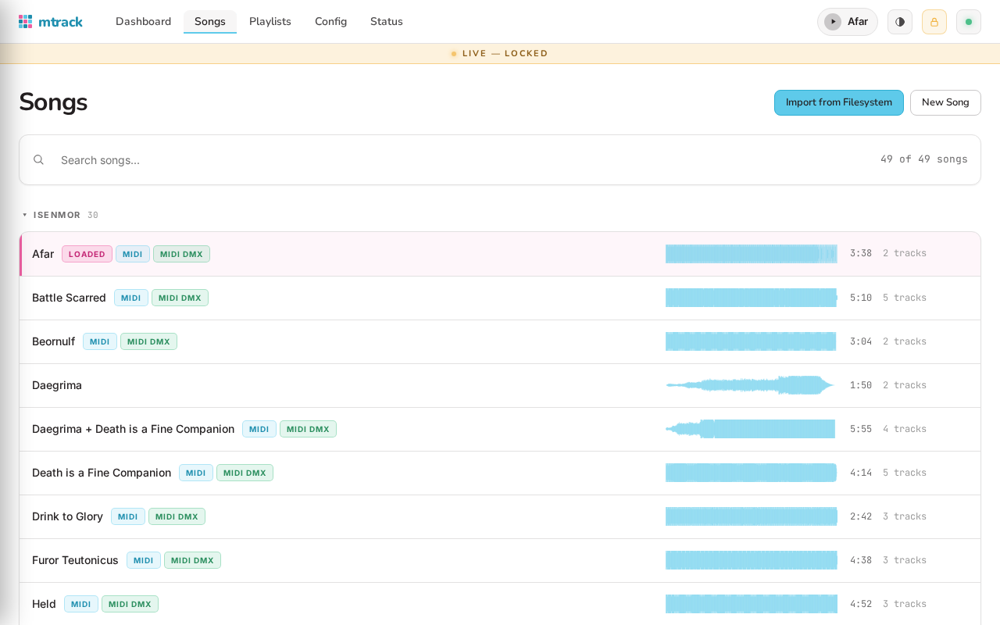

### Creating Songs

Click **New Song** to create a song. Enter a name or path (e.g. `Artist/Song`) — nested
directories are created automatically. The song is created with an empty `song.yaml` that
you can then populate with tracks.

### Importing Songs

Click **Import from Filesystem** to browse the server's filesystem and import existing song
directories.

- **Single import** — Navigate to a directory containing audio files, click "Use This Directory"
  to generate a `song.yaml` from the detected audio, MIDI, and lighting files.
- **Bulk import** — When viewing a directory with subdirectories, click "Import All
  Subdirectories" to import every subdirectory as a song. Subdirectories are scanned
  recursively, so nested structures (artist/album/song) are handled automatically. Directories
  that already have a `song.yaml` are skipped.

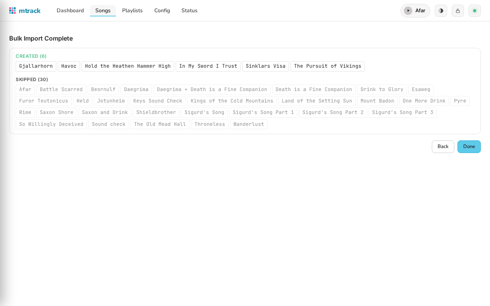

### Deleting Songs

Hover over a song and click the X button to remove it from the registry. This only deletes
`song.yaml` — audio, MIDI, and lighting files are preserved. The song is also removed from
any playlists that reference it.

A song that is currently playing cannot be deleted.

## Song Detail

Click a song to open its detail view with five tabs:

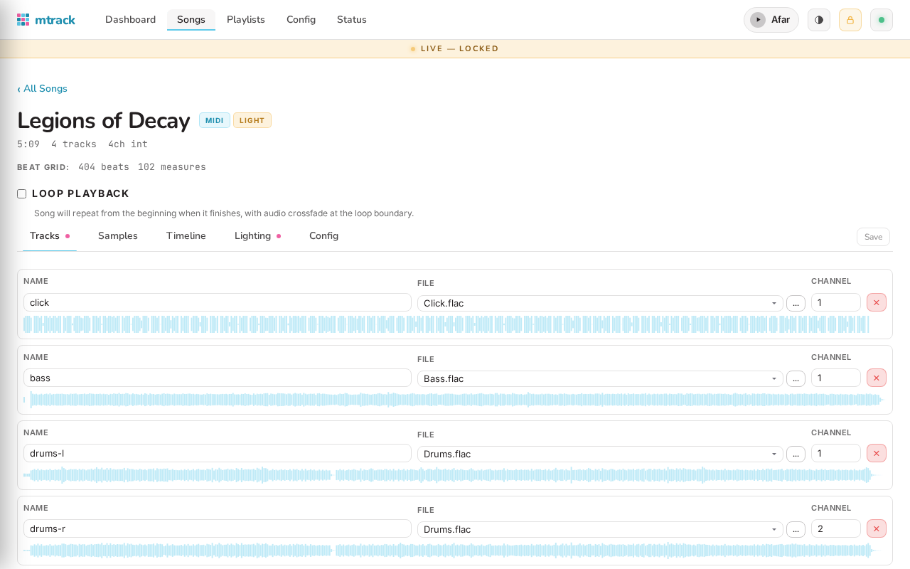

### Tracks Tab

Edit track names, assign audio files, and upload new audio files via drag-and-drop or file
picker. When uploading a file that already exists, you'll be prompted to confirm the replacement.
The MIDI playback file is also configured here — pick from existing files, browse the server
filesystem, or upload a new `.mid` file. When a MIDI file is configured, a 16-channel toggle
grid lets you exclude specific channels from playback. Three preset chips above the grid —
**None / All / Drums only** — cover the common cases; "Drums only" excludes every channel
except 10 (the General MIDI drum channel) for the live-show pattern of mtrack running drums
while the band plays everything else.

Supported audio formats: WAV, FLAC, MP3, OGG, AAC, M4A, AIFF.

### Timeline Tab

Named "Sections" until it grew tempo and pilot lanes, this is a canvas-based visual editor
for the song's timeline: sections (e.g., verse, chorus, bridge).
The timeline displays all track waveforms and beat grid measure lines. Sections can be:

- **Created** by dragging on empty space
- **Resized** by dragging edges — snapping to measure lines, or to individual beats once the
  zoom makes them distinct
- **Moved** by dragging the body, which keeps both boundaries' beat offsets
- **Edited** by tapping a section, which opens its dialog
- **Deleted** from that dialog, or with the Delete key

Zoom controls include +/-, Fit, and Ctrl+scroll wheel with anchor-point zooming. Measure label
density and snap granularity adapt to zoom level. The ruler carries two bands: measure numbers
along the top, the clock underneath.

The lanes below the timeline are the song's tracks. Generated ones are drawn too: the
metronome's click and the pilot cues are rendered from the same config the player synthesizes
them from, so a glance says whether a cue lands where you meant it to, without playing
anything. They are computed per request rather than cached, and the editor refetches after a
save, so they follow tempo and feel edits immediately.

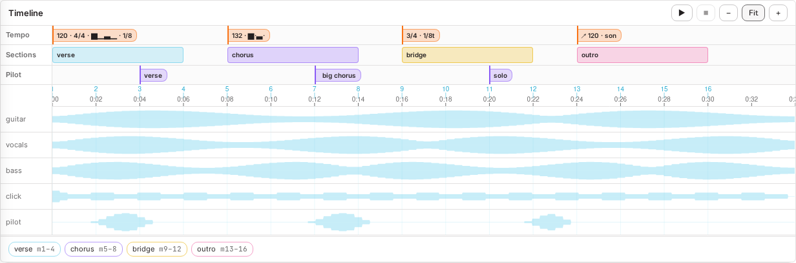

Sections are used for [section looping](#section-looping) during playback.

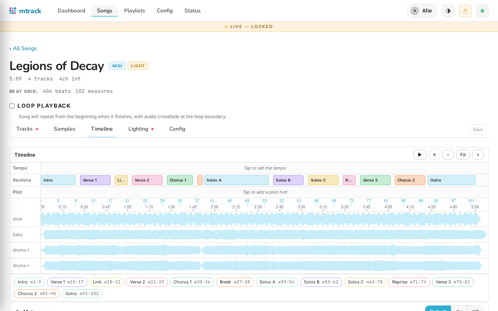

#### Boundaries off the measure line

Real songs change parts mid-measure, so a section's bounds are not limited to measure lines.
`start_beat` / `end_beat` — 1-based within the boundary measure, fractional allowed, omitted
meaning the measure line — offset either end to any position on the beat grid (see
[song configuration](../configuration/song-config.md)). Seeking to a section and looping it
both follow the offsets; a section may even begin and end inside one measure. A beat stays
inside the measure that names it — the position after a 4/4 measure's last beat is the next
measure's downbeat, not a fifth beat — and both the drags and the capture buttons order the
two bounds by the time they resolve to rather than by their measure and beat numbers.

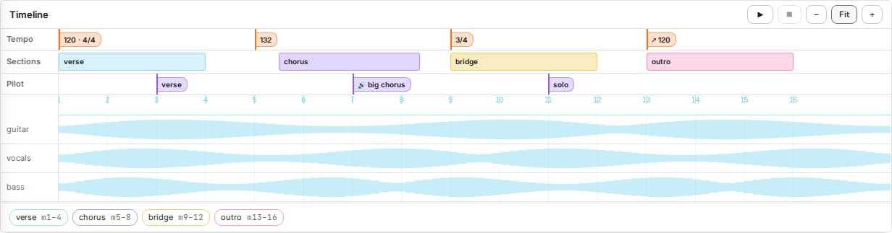

There are three ways to set one, none of which involve counting beats in your head: the
dialog's [position pickers](#positions-one-picker-everywhere), an edge drag once the zoom makes
beats distinct, and — when the song is the one loaded in the player — capturing the playhead.
Play up to the transition, pause, and press **Start here** or **End here**; the capture snaps
to the nearest half beat, and the buttons disable when they would invert the section.

#### The section dialog

Tapping a section opens a bottom sheet with everything drag editing cannot do precisely on a
phone: its name, its start and end — each on its own
[position picker](#positions-one-picker-everywhere) — and its color. Colors come from a
palette — new sections rotate through it automatically — and are stored as `sections[].color`
in `song.yaml`.

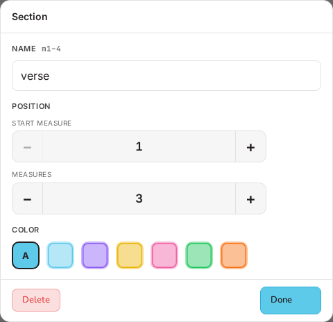

The color follows the section out of the editor: the player's section chips are tinted to
match, so the part you are in is recognisable at a glance from across a stage.

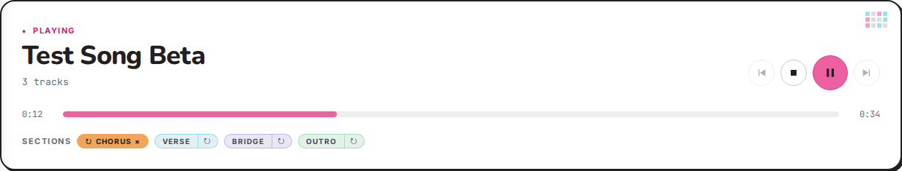

#### Preview transport and the playhead

When the song being edited is the one loaded in the player, the editor grows a playhead — a
draggable line across every lane — plus play/pause and stop buttons and a readout of the
musical position, time, BPM and meter under it. Drag the line to seek, or use the arrow keys
for five-second jumps. Auditioning a boundary no longer means switching to the player and back.

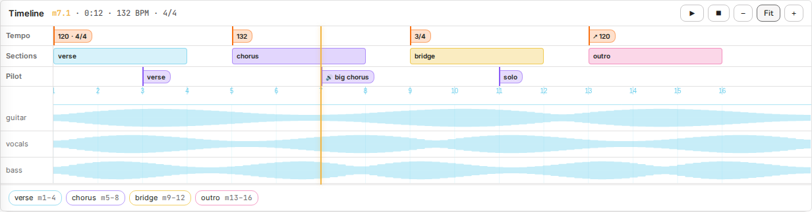

#### Metronome

Under the timeline, the song's metronome panel routes and shapes its click. The tri-state at
the top — **Default / On / Off** — decides whether the song follows the player-wide default
(see [the config editor](#configuration-editor)) or overrides it, which is `enabled` in the
song's `metronome:` block: absent to follow, `true` or `false` to override.

Below it: the track name the click is routed to, the click volume, presets, and the four click
sounds. Volume and sounds both start _inherited from player defaults_ rather than silenced or
pinned — tick the volume to trim this one song against the rest, and a sound left unchecked
stays the player's. A song only carries what it actually changes. Accents and
subdivisions are not here; they live on the tempo markers, since they change mid-song.

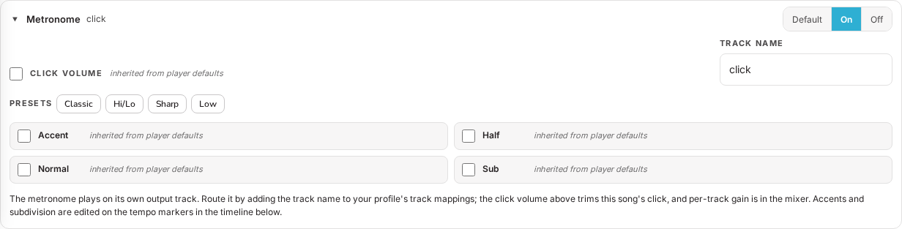

#### Positions: one picker everywhere

Every position in these dialogs — a section's start and end, a tempo marker, a pilot hint — is
edited with the same control:

- A **three-measure ruler** you tap or drag along, one tick per beat and a shorter one per half.
  It follows the meter in effect, so a 3/4 measure draws three beats and is labelled with its
  signature. Holding a drag at either end walks the window along, beat by beat.
- A **transport row** above it: `◀◀ ◀` and `▶ ▶▶` step by measure and by beat, rolling over
  measure lines, and repeat when held. The readout between them can be tapped to type a position
  (`13.4.5`) or a time (`1:23.4`).
- A **beat / time toggle**. What it does depends on what the dialog can store. A pilot hint can
  keep an absolute time, so time mode decouples it: the cursor leaves the grid and the steps
  become 0.01/0.1/1 second. A section boundary or tempo change can only keep a beat, so there
  time is a unit — the ruler still snaps and the clock reads the time of the beat you are on.
- A **playhead capture** row, when the song is in the player: play up to the spot, pause, and
  take it. A hint takes the exact time when it is time-anchored, everything else takes the beat
  it lands on. A tempo change refuses a capture onto a beat another change already holds.

Everything readable sits above the ruler, which is the touch surface: on a phone your hand
covers the ticks and nothing else.

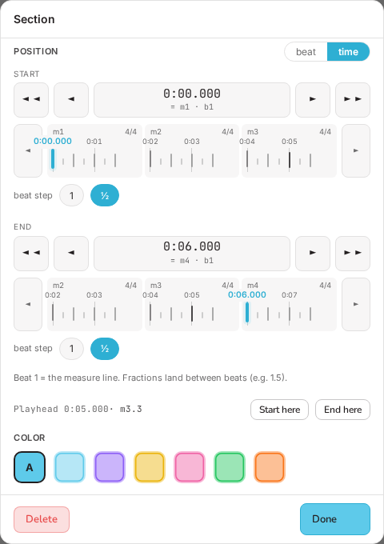

The [section dialog](#the-section-dialog) above shows two of them, with the capture row.

#### Tempo and pilot layers

Above the section lane the timeline shows two DAW-style marker layers, so the song's tempo map
and pilot voice-hints can be authored against the same beat grid:

- **Tempo layer** — one marker per tempo event (the starting `bpm`/`time_signature` plus each
  `change`). Clicking a marker opens the **tempo change** dialog to edit the measure/beat
  position, BPM (with a Tap helper), time signature, and an optional transition (snap, or ramp
  over a number of beats/measures). Clicking empty space adds a change at that measure.
- **Pilot layer** — one marker per voice hint. Clicking a marker opens the **pilot hint** dialog
  to edit the label, the position — anchored to a beat or to an absolute time, converted through
  the beat grid when you switch — and an optional audio clip; a hint with no clip is a visual cue
  only. Adjacent hints group together when their display
  windows overlap.

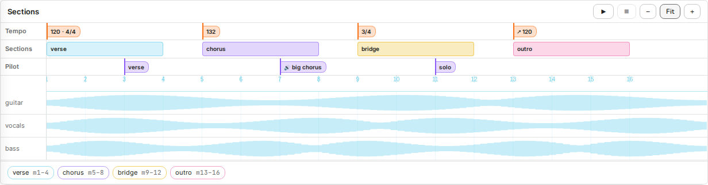

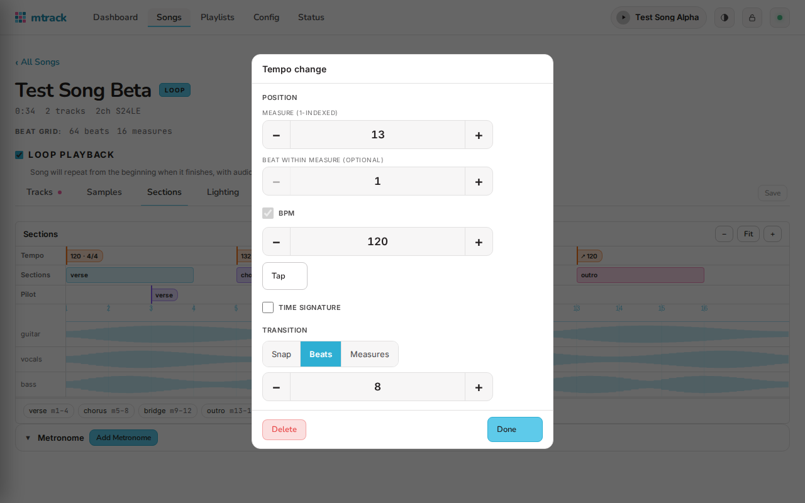

The base marker's dialog also imports: **Guess from beat grid** estimates a map from the
detected clicks, and **Import from _file_** appears for every light show that has its own
`tempo` block. Light shows predate song-level tempo maps, so an existing show is usually the
best seed a song has. Measure-anchored changes copy across as they are; time-anchored ones
snap to the nearest beat on the grid, and the dialog says how many were snapped and how many
had to be dropped — a lossy import is never silent. A show is also free to list its changes
in any order and to put two of them on one position, neither of which a song's `tempo:` block
accepts, so the import sorts them and keeps the last of any repeat — the one the show itself
was playing. Repeats it drops are reported like the rest. The reverse direction lives in
[the show's own tempo editor](#tempo-detection).

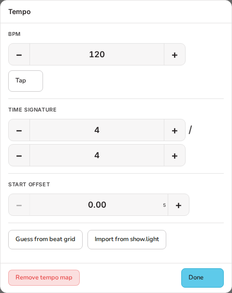

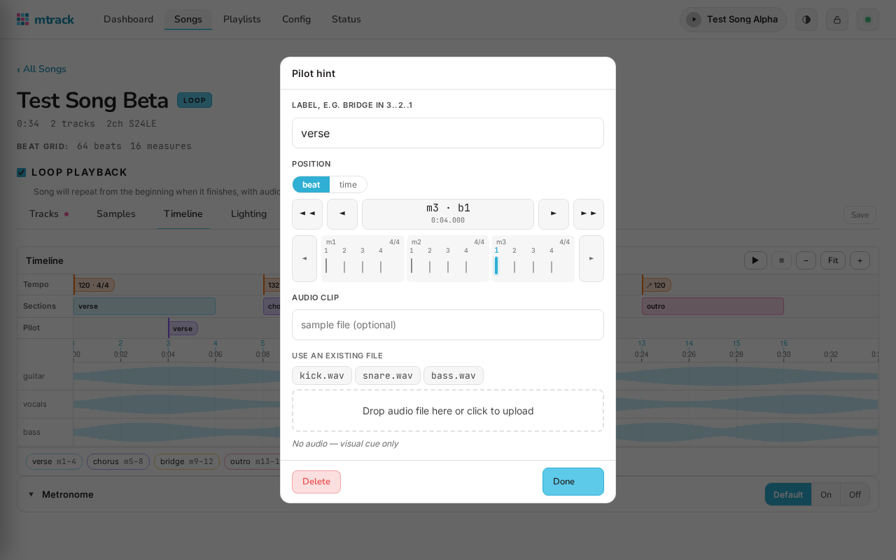

#### Metronome feel

Tempo markers also carry the metronome's _feel_ — the accent pattern and the subdivision in
effect from that measure on. The base marker edits the song-level values; any later marker can
change either one, on its own or alongside a tempo change. Each marker's chip labels what it
changes, with the accent pattern drawn as a per-beat glyph and the subdivision as its note value
(`1/8`, `1/8t`, `son`, …).

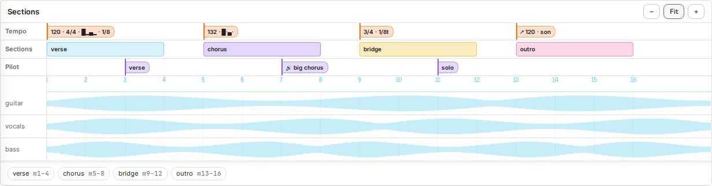

The dialog's accents and subdivision sections are individually toggleable. **Accents** are tapped
per beat, each tap cycling that beat one step — silent, normal, half accent, accent. **Subdivision**
is picked from note values relative to the meter's beat (in 4/4: quarter, eighths, triplets,
sixteenths, sextuplets), plus the son and rumba claves, which play their hit pattern over a
two-measure cycle.

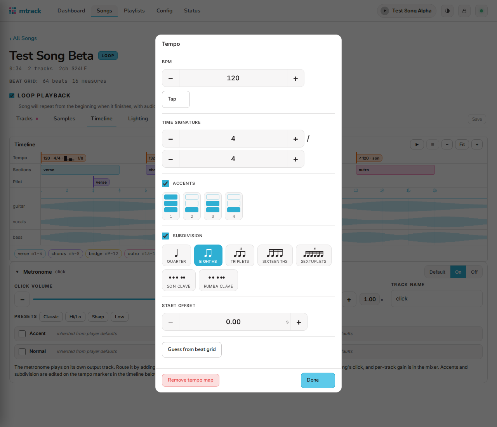

A change marker shows only the aspects it overrides; here a tempo change with an 8-beat transition
that also switches the feel to a son clave.

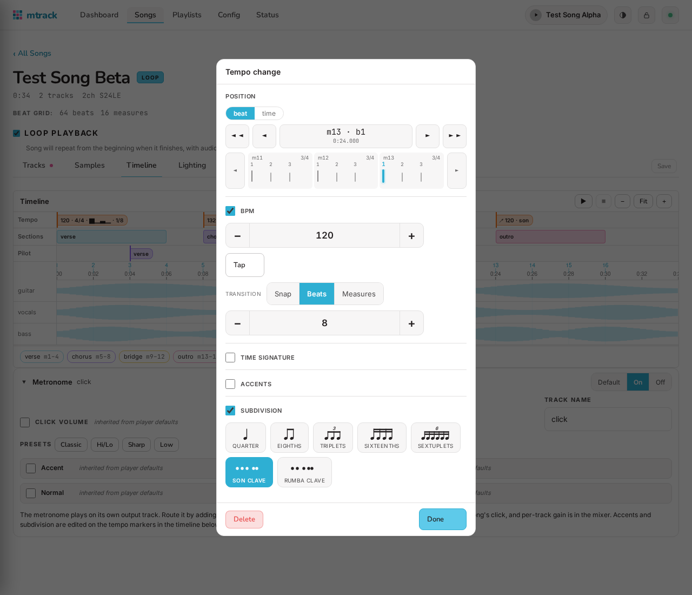

While playing, the visual metronome on the [dashboard](#dashboard) mirrors the resolved
levels, so what you see matches what the click plays.

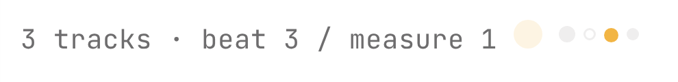

### Lighting Tab

The lighting tab contains the **timeline editor** — a DAW-style visual editor for authoring
lighting cue shows. See [Timeline Editor](#timeline-editor) below.

Light show files (`.light`) can be added and removed directly from this tab. Adding or removing
files is deferred until Save, so navigating away without saving leaves the disk untouched.

### Config Tab

Edit the raw `song.yaml` configuration directly. Song-specific notification audio overrides
are also configured here — these let you override profile-level notification sounds for
individual songs, with section names autocompleting from the song's defined sections.

### Saving

The **Save** button in the tab bar saves both the song configuration and any lighting file
changes. The button shows "Unsaved" when there are pending changes. Ctrl+S / Cmd+S keyboard
shortcut is also supported.

## Timeline Editor

The timeline editor provides a visual interface for creating and editing lighting shows,
with integrated playback preview.

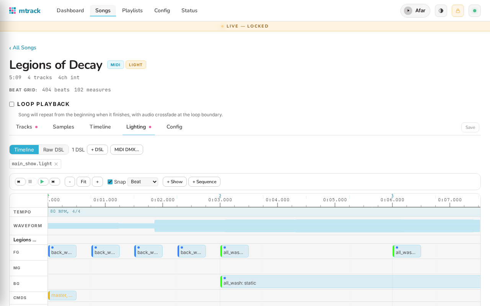

### Layout

- **Toolbar** — Transport controls, zoom, snap-to-grid, and add show/sequence buttons.
- **Time ruler** — Shows absolute timestamps and measure/beat grid (when tempo is defined).
  Click the ruler to set the play cursor position.
- **Waveform lane** — Reference waveform of the song's audio.
- **Show lanes** — Each show has three layer lanes (Foreground, Midground, Background) plus
  Commands and Sequences lanes. Effect blocks display their actual duration as block width and
  can be resized by dragging a right-edge handle. Sequence references are expanded inline,
  showing each iteration's effects at their correct timeline positions (visually distinct with
  dashed borders and pink tint).
- **Bottom panel** — Stage preview (left) and cue properties editor (right). The bottom panel
  is collapsible with a toggle button.

### Transport Controls

The toolbar includes a full transport:

| Button | Action                                        |
| ------ | --------------------------------------------- |
| ⏮     | Skip to start of timeline                     |
| ■      | Stop playback and reset cursor to start       |
| ▶ / ⏸  | Play from cursor / Pause (remembers position) |
| ⏭     | Skip to end of timeline                       |

**Keyboard shortcuts:**

- **Space** — Toggle play/pause
- **Home** — Skip to start
- **End** — Skip to end

When you press **Play**, mtrack plays the song's audio with synchronized lighting effects.
The green playhead line animates across the timeline and all show lanes, and the stage
preview shows the real-time fixture output. If there are unsaved lighting changes, they
are auto-saved before playback starts.

Pressing **Pause** stops playback and remembers the playhead position — pressing Play again
resumes from that point. Pressing **Stop** resets the cursor to the beginning.

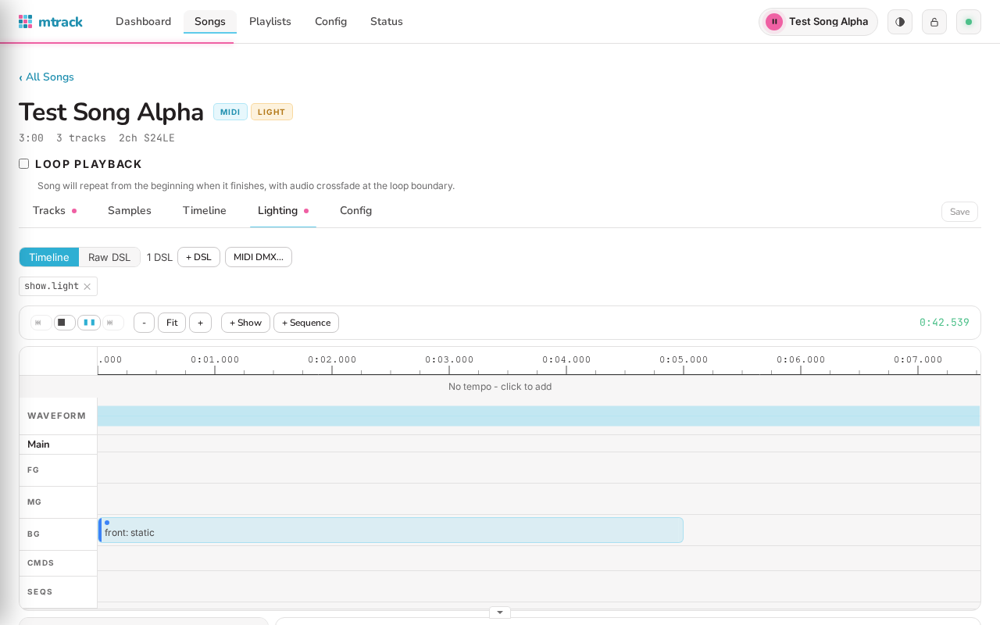

### Stage Preview

The bottom-left panel shows a compact stage visualization with real-time fixture RGB output,
glow effects, strobe animation, and active effect names. It draws the same picture as the
dashboard stage view: a stage plot with focus pins when the venue has positions, the tag layout
otherwise. Positions are edited on the dashboard; here, dragging only rearranges the tag layout.

### Editing Cues

- **Double-click** a layer lane (foreground/midground/background) to create a new effect
  at that position, assigned to the correct layer with a default `1measure` duration
  (when tempo is available).
- **Click** a cue block to select it and open its properties in the bottom-right panel.
- **Drag** a cue block to reposition it. When snap-to-grid is enabled, cues snap to
  beat or measure boundaries.
- **Resize** — Drag the right edge of an effect block to change its duration. Resizing
  snaps to the nearest beat or measure boundary (matching the snap resolution setting).
  Hold Ctrl/Cmd while releasing to bypass snap for free-form sizing. Durations prefer
  measure/beat units (e.g. `1measure`, `2beats`) when aligned to the tempo grid.
- **Delete** — Select a cue and use the delete button in the properties panel.

### Effect Properties

When a cue is selected, the properties panel shows its effects, commands, and sequences.
Each effect has:

- **Group** — A dropdown populated from the venue's fixture groups, with free-text entry
  for custom groups.
- **Effect type** — Static, cycle, chase, strobe, pulse, dimmer, rainbow.
- **Parameters** — Type-specific controls (colors, speed, frequency, direction, etc.)
  with appropriate dropdowns for constrained values.
- **Layer & blend** — Layer assignment and blend mode for compositing effects.
- **Timing** — Fade up/hold/down times.

### Zoom and Navigation

- **+/- buttons** or **Ctrl+scroll** to zoom in/out. The view anchors on the center
  (toolbar buttons) or the mouse position (scroll wheel).
- **Click and drag** the ruler to pan.
- **Fit** button to fit the entire timeline in view.
- **Snap** toggle with beat, measure, or subdivision resolution (1/2, 1/4, 1/8, 1/16 beat)
  when tempo is defined.

### Tempo Detection

The tempo lane in the timeline shows the song's tempo map. Clicking it opens the tempo editor
with controls for BPM, time signature, start offset, and tempo changes.

- **Detect from MIDI** — When the song has a MIDI file, the editor can extract an authoritative
  tempo map directly from MIDI `SetTempo` and `TimeSignature` meta events. Consecutive
  monotonic BPM changes (ritardandos/accelerandos) are automatically collapsed. If the
  MIDI-predicted beat positions don't align well with click-track detections (RMSE > 15ms),
  a warning badge indicates the MIDI file may not match the recording.
- **Guess from beat grid** — When no MIDI file is available but the song has a click track,
  the editor can estimate a tempo map from the detected beat grid. Results are displayed with
  an "estimated from beat grid" badge.
- **Copy from song timeline** — When the song already carries a tempo map of its own, the
  show can take it wholesale rather than being authored twice.

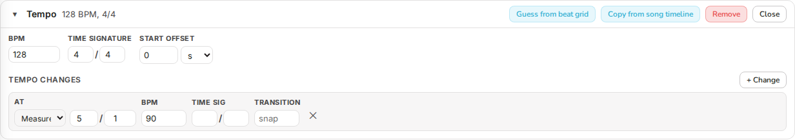

### Sequences

Click **+ Sequence** in the toolbar to create a reusable cue sequence. Sequences appear
as chips in the detail area and can be edited in a modal with its own timeline. Reference
sequences from show cues to reuse patterns.

### Raw DSL Tab

Switch to the **Raw DSL** tab to edit the lighting DSL text directly. A **Validate** button
checks the syntax without saving. Switching back to the Timeline tab re-parses the DSL.

## Playlist Editor

The playlist editor provides a left panel for browsing, creating, and deleting playlists,
and a right panel for editing song order (reorder, add, remove) with a searchable
available-songs list.

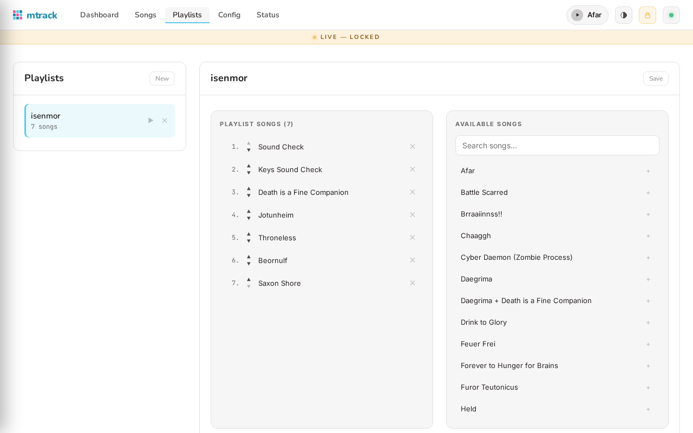

Playlists are stored as individual YAML files in the `playlists/` directory. The `all_songs`
playlist is always present and auto-generated from the song repository.

Use the **Activate** button to switch the player to a playlist. This can also be done from
the dashboard's playlist dropdown.

## Lighting

The **Lighting** item in the top navigation holds everything about lights, in one place. It has
six pages, shown as tabs across the top. Each page has its own address, so you can bookmark it:

| Page | Address | What it holds |
|---|---|---|
| Overview | `#/lighting` | The readiness checks: will your show reach the lights? |
| Fixture Types | `#/lighting/fixtures` | The kinds of fixture in your rig |
| Venues | `#/lighting/venues` | Where fixtures sit, and the stage plot |
| Groups | `#/lighting/groups` | Logical groups and the current venue, for one hardware profile |
| Fit shows | `#/lighting/fit` | Fit your shows to the venue and the rig: tags, focus points, outputs |
| 3D | `#/lighting/stage` | The venue as a room |

Two kinds of state live here, and they are stored differently.

**Project files** — fixture types and venues — are the same whichever hardware profile is
running. Fixture Types and Venues edit them directly. The directories they are read from come
from the running profile's lighting settings, or the defaults if it sets none.

**Profile settings** — logical groups and the current venue — belong to one hardware profile,
because the rig at home and the rig on tour select different venues. The Groups page edits them
for the profile you pick. It starts on the profile the player is running (the one whose
`hostname` matches the Status page). When no profile matches this host, or the status cannot be
read, nothing is selected: the page says so, and Save stays disabled until you choose a profile
from the list. (It never falls back to the first profile, which could be another machine's.) A
link such as `#/lighting/groups?profile=my-host` opens it on another profile. Saving goes through
the same API as the Config page: a profile file when the config sets `profiles_dir`, otherwise the
profile inside `mtrack.yaml`. A profile with no DMX section has nothing to edit here; the page
links to Config to enable lighting first.

Saving rewrites the profile. **Comments in the YAML are not kept**, because the YAML library
does not preserve them. A profile *file* keeps the keys mtrack does not model (they are copied
across from the existing file); the profile inside `mtrack.yaml` is rewritten whole, so it loses
comments and unknown keys alike. Keep notes you care about somewhere other than a profile the web
UI saves. A profile file saved from two pages or tabs at once is protected: the page reads the
file's version, and a save made after the file changed is refused. The page reloads the profile
and asks you to make the change again.

### Overview: will your show reach the lights?

The Overview answers one question, and says what to fix when the answer is no. It shows five
checks, numbered in the order a show needs them, then a **Needs attention** list, then the live
stage. Every check is something mtrack already works out; the Overview gathers them in one place.

| Check | Ready when |
|---|---|
| 1. Fixture types | Every fixture in the current venue has a type that loaded. A type made from a GDTF file counts only if the file could be read. |
| 2. Venue | A current venue is chosen and loaded. |
| 3. Groups | Every group your songs' shows use finds at least one fixture in the current venue. |
| 4. Shows | Every song's light shows load, and nothing stops a cue from doing what it says (for example, a strobe sent to fixtures that cannot strobe, or a cue aimed at a focus point the venue does not have). |
| 5. Output | Every universe the venue's fixtures use has an output under `dmx.universes`, and olad has an output port patched to each. |

Each check is in one of four states, always written out in words and not only shown by colour:

- **Ready**: nothing to do.
- **Needs attention**: the show plays, but something will not do what it says.
- **Blocked**: nothing reaches the lights. There is no venue, no DMX output, a fixture type that
  did not load, a show that does not load, or a universe with no output.
- **Unknown**: mtrack could not find out. This happens when a check depends on another that is
  blocked (a fixture type cannot be checked with no venue), and when olad's web server does not
  answer, so the patch cannot be read.

A ready check shows a one-line summary, such as "8 fixtures, all placed". A check that is not
ready shows how many things need fixing.

The **Needs attention** list has one entry per finding, grouped by check, and each entry links
to where it is fixed: Fixture types, Venues or Groups in this area, the song's lighting editor
for a show, and the running profile's DMX settings in Config for output. Some notes from a
song's show checks, such as a cue that starts after the song ends, are listed under the song
marked **Note**. They are worth reading, but they do not change a check's state.

The page checks again when the venue or the configuration reloads, so after you fix something,
the check turns ready without a refresh. A profile with no DMX output shows only the Output check
as blocked, with a link to enable it.

### Fixture Types

Both fixture-type file forms are listed. A `.light` type opens in the channel-map form; a
`.fixture` type (rich channels, or distilled from a GDTF archive) opens as the text of its file.
**Import GDTF** uploads a `.gdtf` archive and opens a mode picker: a filterable list of the
archive's DMX modes with their address counts and cells, and for the selected mode a panel of
what your shows can do in it, in plain words. A refused mode is listed greyed with its reason.
The mode you choose is the type's **default**: each fixture in a venue can use another mode of the
archive. **Add fixture type** writes the referential `.fixture` (the same as `mtrack import-gdtf`; see
[GDTF-referential fixture types](../lighting/configuration.md#gdtf-referential-fixture-types-fixture)).

A type made from a GDTF archive has a card that says what the fixture is: its picture (once the
type has loaded and its 3D model is made), the manufacturer and fixture name, how many modes the
archive has and its beam, and one pill per mode the venues use with how many fixtures use it (the
three most-used, then "+N more"), or the default mode alone when no fixture uses the type.
Opening it shows the fixture first and its definition last: a 3D view of the fixture (drag to turn
it; the archive's thumbnail stands in when the browser cannot draw 3D) beside what the archive
states about it — the archive's path, its mode count, the beam, light output, power, which venues
use it, and the manufacturer's own description. A figure the archive does not state is left out.
Below that is every mode of the archive, with a filter: the type's default is marked
**default · N in use**, and any other mode a fixture uses says **N in use**. Choose a mode to see
what your shows could do in it, its channels, and which fixtures use it. A fixture whose mode is
not in the archive is named in red under the facts. A fixture's mode is chosen in the venue's
inspector (below).

Below the modes, **Your settings for this fixture** holds the three things in the type's file that
are yours: its **name** in venues and shows, its **default mode** (the select lists every mode of
the archive; a mode's detail also has **Make this the default mode**), and, for a fixture that can
pan or tilt in any mode, its **movement limits** (max pan and tilt speed, in degrees per second;
blank is no limit). **Save settings** first says what the save will do and asks before writing
when it matters:

- A new default changes every venue fixture that takes the default, so it says how many, in which
  venues ("8 fixtures in built-in use the default and will change to 9: RGBWS"), and checks their
  new footprint: fixtures it would newly run over are named as a warning.
- A rename rewrites every venue line that names the type, in every venue file, keeping comments
  and layout, and says how many lines in which venues. If any venue file cannot be rewritten (it
  does not parse, or it changed meanwhile), nothing is written and the message names the file.
  Inline fixtures in the player config that name the type are listed for you to change by hand.

The type's file is patched in place: its comments, the archive path as written and anything else in
it stay. The file itself is behind **Saved as … · show the file**, editable as text with its own
**Save the file**. Only one of the two may have unsaved changes at a time: while your settings have
unsaved changes the file is read-only, and while the file has unsaved edits the settings are
locked. Saving either reloads both. Hand-written types keep the channel-map form or text editor.

### Venues

Lists the venues and edits their fixtures: name, type, universe, start channel and tags. Saving
a venue keeps everything the form does not show — fixture positions and rotations, focus points,
and where an MVR import came from.

**Add Fixture** continues the patch from the last row: the new fixture is named `Fixture N` (the
first number not taken), takes the last row's type and universe, and starts straight after it
(its address plus its type's footprint, so a 3-channel fixture at 1 is followed at 4). A fixture
that would run past address 512 starts the next universe at 1. Changing an earlier row never
renumbers the rows after it. Nothing you added is dropped on save: a row with no name, no type,
a name another row has, or a universe or address below 1 stops the save, is outlined with what
to fix, and gets the focus. The fixture type editor treats channel rows the same way, a tag with
no allowed character stays in its box marked, and a group, inline fixture or focus point rename
that is refused (empty, or a name already taken) says so instead of quietly reverting. When the
current venue did not load, the plot on this page shows its file instead of an empty stage, so
the fixture at fault can be selected and fixed in the inspector.

Click a venue in the list to select it; **Edit** opens its fixture form. The plot below shows
the selected venue. When it is the current venue (marked *current*, or when none is selected),
the plot is the live stage. When it is any other venue, for example one you just created, the
plot is a plain view of that venue's file, labelled *not live* and without live fixture colour.
Placing, arranging and aiming work the same way and save to that venue.

Two tabs or pages can edit one venue. Every venue save carries the version of the file it was
based on (a hash of its bytes, sent as `If-Match`). If the file changed since it was loaded, the
save is refused and the page reloads, and you make the change again. Saves never regenerate an
existing file: the file that defines the venue is found by scanning the venue files for its
block (its name need not match the file name) and patched in place, keeping comments and `# TODO`
lines (`#` and `//` comments both). A file that no longer parses is refused with the file's name
so you can fix it by hand; nothing is overwritten.

Beneath the list is the stage plot, the same view as the dashboard's stage card but editable.
Drag a fixture from the tray onto the stage to place it, or drag a placed fixture or a focus pin
to move it. Each drag writes the new coordinates to the venue file, the running engine reloads
the venue, and every open stage view redraws from the file. The **+ Focus point** button adds a
pin, and the list beneath the plot renames or deletes them. Focus points are the stage points a
show aims at, so name them for what they are ("drummer", "center-stage"). A fixture dragged from
the tray is hung at 3 m; edit the venue file to correct its height.

**Selecting.** Click a fixture on the plot to select it, shift-click to add or remove one, or
drag a box on the empty deck to select what it encloses (shift adds the box to the selection).
**Escape** clears it. The inspector beside the plot (below it on a phone) lists every fixture with
a checkbox that mirrors the selection and drives it. Dragging a fixture moves it as before, and a
click that does not move saves nothing.

The inspector shows what is selected:

- **One fixture** shows its own fields: name, type, universe, start channel and tags, saved by
  **Apply**. A fixture of a GDTF type also has a **Mode** select: *Type default (8: RGBS)* leaves
  the line without a mode, and every other mode of the archive is listed with its footprint
  (refused modes are shown but cannot be chosen). Choosing a mode saves it at once. Below it a
  strip shows the fixture's universe around it, one cell per address: this fixture, the other
  fixtures (hover a cell for who), and overlaps in red. A mode or an address that would run into
  another fixture's addresses is refused before anything is saved, naming the fixture in the way
  and the largest mode that fits — for example *Not saved. 13: DIM RGBAWS needs addresses 9 to
  15, and Brick4 already uses some of them. Move Brick4 or pick a mode of 4 addresses or fewer.*
  Fixtures patched to exactly the same addresses (ganged) are not in each other's way. The check
  reads the venue's files, so it works with no DMX output running. A file that already has
  overlaps still saves; the Overview lists them.
- **Several** show the type and tags they share, and the two tools below.

**Arrange** (two or more placed fixtures) writes positions. **Align on a line** puts a side
column at its mean x, or a row at its mean y, whichever way the selection spreads more.
**Space evenly** keeps the two extreme fixtures and spreads the rest evenly between them along
the same line, in their current order. **Mirror across centre** turns each x into its negative,
about the centre line at x = 0. While the plot has keyboard focus, the arrow keys nudge the
selection 0.1 m (1 m with shift); a burst of key presses is one save.

**Aim** writes rotations. A fixture with pan or tilt channels is a mover; everything else is
fixed. For fixed fixtures, **Face a direction** takes stage left, stage right, upstage,
downstage or a bearing in degrees, and a **tilt up from the floor** (0 is level, negative aims
down), and writes the rotation that does it. **At a focus point** picks one of the venue's focus
points and writes, for each selected fixture, the rotation that points its beam at it (a
fixture standing on the point is skipped, and the inspector says so). For movers, **Hung,
facing downstage** and **Standing on the deck** write the two mountings the
[pose convention](../lighting/configuration.md#mounting-and-pose-convention) names; aiming a
mover is the show's job. The raw rotation is always shown and editable. The plot draws each
fixed fixture's beam from its rotation, so an aim is checked at once.

Every operation is one save of the venue file, and keeps the focus points, provenance and every
field the operation did not change, a fixture's mode included. When a save leaves the current
venue unable to load, the save still happens and the message where you saved says so, naming the
fixture and why.

### Import an MVR

**Import an MVR** on the Venues page (and a link on the Overview) opens a four-step wizard at
`#/lighting/import`, over the same library as `mtrack import-mvr` and the MCP tools. The
browser keeps the file and uploads it at each step; the server holds nothing in between, and
nothing is written until the last step.

1. **File.** Drop an `.mvr` or choose one. The page shows what it holds: fixtures, fixture
   types that have a GDTF mode and fixtures that do not, universes, focus points and scenery.
   The venue name defaults to the file's name; an existing venue of that name that came from
   this MVR is merged into. A file that is not an MVR, or is over the archive caps, is refused
   here with the reason.
2. **Stage origin.** A top-down plan of the file's fixtures, focus points and scenery, in the
   file's own millimeters (up the page is upstage). Click the front edge of the deck, in the
   middle: that point becomes the stage origin. A ring marks a **suggestion**, and **Use the
   suggestion** applies it: the middle of the deck's front edge, at the deck's top, when the
   scenery carries a stage floor; otherwise the middle of the fixtures' front edge at the floor.
   The X, Y and Z fields hold the chosen point and can be typed in; on the focused plan the arrow
   keys move it 100 mm (1 m with shift).

   mtrack finds the deck by name: a plain scene object (not a truss, support or screen) whose
   name or mesh file says *stage*, *deck*, *floor*, *podium*, *riser*, *platform* or the like,
   sized from the bounds of its glTF (`.glb`) meshes. A file whose stage floor is named
   otherwise, or drawn only as `.3ds`, has no deck to suggest and falls back to the fixtures.
3. **Review.** What the import will do, without writing it: whether this seeds a new venue or
   merges into an existing one (a merge keeps tags, focus names and fixtures you added by hand),
   fixtures to seed, fixture types to import and which are already in the library, fixtures that
   become `# TODO` lines with the reason for each, and how much scenery the 3D view can draw.
   On a merge it also lists the fields you edited by hand that the MVR would overwrite, each with a
   **Keep my edits** checkbox: positions, rotations and focus points start checked, patch and
   type start unchecked.
4. **Import.** Writes the files and reports them. Two buttons follow: **Fit your shows**, since a
   seeded venue is untagged, and **Open in Venues**. Importing does not make the venue current;
   pick it on the Groups page.

### Export an MVR

**Export an MVR** on a venue's card opens a dialog. It takes the file name (default
`<venue>.mvr`, made file-name-safe), **One layer per first tag**, and shows a summary computed
without writing anything: fixtures and how many have positions, GDTF files embedded from the
library and generated for native types, focus points, and how many fixed fixtures are linked to
a focus point.

Pre-viz tools aim a fixed fixture (one with no pan or tilt) at its linked focus point and,
without one, at the origin. When some are unlinked the dialog says so and offers **Add an aim
point per fixture**: for each one, a focus point named `<fixture> aim` is added to the venue
file where its rest beam meets the deck, or 3 m along the beam when it does not meet the deck
within 50 m. Fixtures with no position are skipped, and the rest of the file, including
positions, rotations and comments, is left as it was. The summary is read again and the export
links them. **Export as is** downloads without adding any. **Download** sends the `.mvr` to the
browser; nothing is written under `lighting/export/` unless **Keep a copy in the project** is
ticked.

### Groups

Directories, the current venue, inline fixtures and logical groups with their constraints. Pick
the profile at the top. **Save** writes that profile; leaving the page with unsaved edits asks
first.

### Fit shows

An imported venue arrives with no tags, so every group a show uses finds no fixtures; a console's
focus points carry the console's names; and its universes have no output on this profile. The
Overview says so, and its findings for groups, unbound focus points and outputs link here. Fit
shows fixes them in one place, in three columns (stacked on a phone):

- **Groups your shows use** lists every group any song's shows target, with the tags its
  constraints need, how many fixtures it finds in the current venue and which songs use it.
  Groups that find nothing come first. Select one to drive the other two columns.
- **The plan** is the stage plot. A solid ring marks the fixtures the selected group finds; a
  dashed ring marks the pending selection. Click a fixture to add it to the selection or take it
  out.
- **Fixes** starts with a **suggestion** for the selected group: the fixtures that can do what
  the shows ask of it (a `move` needs pan or tilt, a colour cue colour channels, a `strobe` a
  strobe channel, `per: cell` cells), grouped by fixture type and, when the venue places them,
  by where they hang (deck, low rig or truss; downstage, midstage or upstage). The largest set is
  the suggestion, with the reason in words; if nothing fits it says which need nothing meets.
  **Apply** adds the group's tags to those fixtures in the venue file, keeping positions,
  rotations, focus points and the MVR provenance, and the engine reloads the venue. **Pick
  others** offers the other sets, or lets you choose fixtures by hand on the plan or from a list;
  **Tag N fixtures** then applies the group's tags to your selection. Nothing is tagged without a
  click.

  Below that, **focus points your shows aim at** that the venue lacks each have **Place on
  plan**: the next click on the plan creates a point with that name (pressing Enter on the
  focused plan puts it at the center). **Output** lists universes the venue uses that the running
  profile has no output for, with **Add to profile**, which appends `{universe, name: "u<N>"}`
  to the profile's DMX universes and saves it as Config does; and universes olad has no port
  patched to, with the `ola_patch` line to run (fill in your device and port).

A footer repeats the Overview's Groups check ("2 of 6 groups find fixtures"). The same
suggestion is available to agents as the MCP tool `suggest_group_tags`. A link such as
`#/lighting/fit?group=movers` opens the page with that group selected.

### 3D

The venue as a room; see [Stage 3D](../lighting/configuration.md#stage-3d). The old address
`#/stage` still works and redirects here.

The header carries a **Live / Preview** switch, and a badge beside the title says which is
showing. **Live** draws what the engine is sending. **Preview** draws what a song's show would
do at a moment you choose, without playing anything: pick a song (any song with lighting that
loads) and drag the scrubber, or step it with the arrow keys; the song's sections are drawn
along it as the dashboard's timeline draws them. The show is worked out offline, so a song
that is playing keeps playing and nothing reaches the lights.

Beneath the scrubber, **At this moment** says in words what each group is doing (for example
"movers: move, 50% done (2.0 s of 4.0 s)"), **Untouched by this show** counts the fixtures no
cue targets and names them when expanded, and **Open this cue in the timeline** opens the
song's lighting editor with its cursor at the scrubbed time (`#/songs/<name>/lighting?t=<seconds>`).
Small notes over the scene appear only when they apply: fixtures whose colour comes from a
wheel are drawn white, beams that miss the deck are drawn at a fixed length, and in Live,
that nothing has been received from the engine yet. `#/lighting/stage?mode=preview&song=<name>&t=<seconds>`
opens the page in Preview at a moment.

## Configuration Editor

The config editor provides a profile-based hardware configuration UI with tabs for:

- **Audio** — Device selection, sample rate, format, buffer size, track mappings
- **MIDI** — Device selection, beat clock, MIDI-to-DMX passthrough mappings with Note Mapper
  and CC Mapper transformer editors
- **DMX** — OLA host/port, universe mappings
- **Lighting** — The DMX hardware: OLA host and port, universe mappings. Below it, a summary of
  the profile's current venue and group count, with an **Edit in Lighting** link. Fixture types,
  venues and groups are edited in the [Lighting](#lighting) area
- **Triggers** — Audio and MIDI trigger inputs with calibration
- **Controllers** — gRPC, OSC, and MIDI controller configuration. The MIDI controller section
  supports full editing of event mappings (play, prev, next, stop, all_songs, playlist) with
  optional section_ack and stop_section_loop events, plus Morningstar preset naming integration
- **Status Events** — MIDI events emitted on player state changes (off/idling/playing) for
  hardware LED feedback
- **Notifications** — Custom audio files for loop armed, break requested, loop exited, and
  section entering events, plus per-section-name overrides
- **Metronome defaults** — the click sounds every song starts from, and whether the click is
  on by default

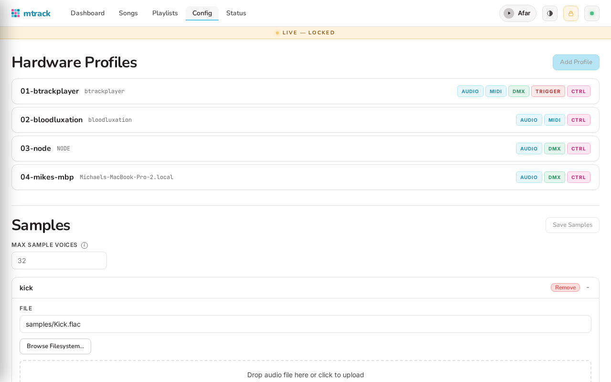

Click a profile to open its settings with tabs for each subsystem:

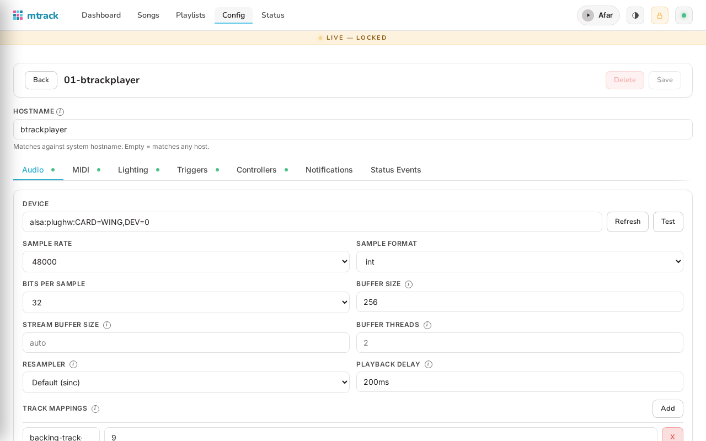

Changes are saved with optimistic concurrency (checksums) and trigger automatic hardware
reinitialization.

### Testing an audio device

The **Test** button beside the device picker opens the selected device with the settings
currently in the form, waits for its output callback to run, and closes it. It answers the
question the picker cannot: a device's name resolving proves it exists, not that the format
will be accepted or that a callback will ever fire.

It is silent. No audio is played — the device is handed zeroes and the liveness counter
confirms the callback ran — so it is safe to run with the PA up, which is the point. It takes
up to about two seconds.

The settings matter. A device that opens at one sample format and refuses another is the
failure this catches, so the result is cleared whenever a setting changes: it describes the
settings it was run with, not the device in general.

If the device you test is the one mtrack is already playing through, it is reported from its
live health rather than reopened — it would refuse a second open. Testing a *different* device
is rejected during playback, as with every other hardware change.

What it cannot prove is that sound reached the room. A device can accept every buffer and
produce nothing; this rules mtrack out, not the rig. The same check is available headless as
`mtrack test-audio <config>`, which exits non-zero when the device cannot stream.

### Metronome defaults

With a dozen songs, click levels and sounds are a player decision rather than a per-song one.
The Metronome section edits the `metronome:` block of `mtrack.yaml`: a master click volume
over the whole mix, the four click roles (accent, half, normal, sub) with volume, frequency
and an optional sample file each, four presets to start from, and a checkbox that turns the
click on by default for every song with a tempo map. Each sound previews in the browser — the speaker button synthesizes the same
envelope the player uses, so you can audition without routing audio.

Songs inherit all of it and override only what they set; see
[the song's metronome panel](#metronome).

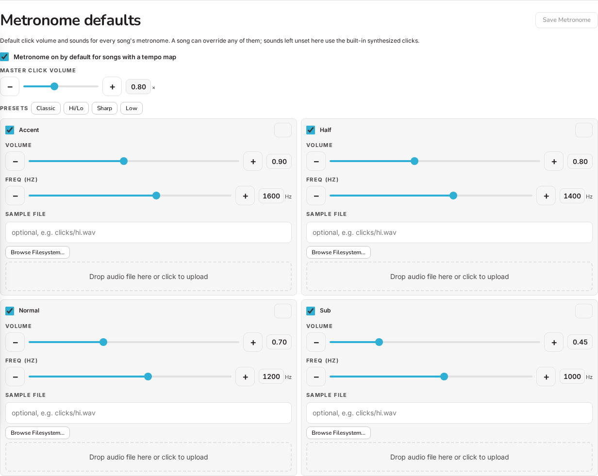

## Song Looping

mtrack supports two levels of looping:

### Whole-Song Looping

Songs with `loop_playback: true` in their `song.yaml` loop indefinitely. Audio crossfades
seamlessly at loop boundaries (100ms linear fade), MIDI restarts from the beginning, and
lighting/DMX timelines reset cleanly. During a looping song, pressing Play or Next breaks out
of the loop, advances the playlist, and auto-plays the next song.

### Section Looping

Named sections (defined by measure — and optionally beat — ranges in the Timeline tab or
`song.yaml`) can be looped
during playback. Activate a section loop from the dashboard's section buttons, or via gRPC
(`LoopSection`/`StopSectionLoop`) or MIDI controller events (`section_ack`, `stop_section_loop`).

When a section loop is active:

- Audio crossfades at section boundaries (100ms linear fade)
- MIDI restarts from the section start with hard cut
- DMX/lighting timelines reset to the section's start time
- A confirmation tone plays through the `mtrack:looping` track mapping
- Next/Prev navigation is allowed during looping

Section activation is rejected if playback has already passed the section end.

## Status Page

The status page shows build information and hardware subsystem status in a two-column grid
layout:

- **Audio, MIDI, DMX, Trigger** — Each shows "connected", "initializing", "not connected",
  or "not configured" with the device name when connected. Subsystems that aren't currently
  connected get a **Configure →** or **Fix →** pill that deep-links to the relevant section
  in the config editor for the active profile.
- **Controllers** — Per-controller status (running / error) with a Restart button.
- **Profile** — The matched hostname and active profile name.

The page auto-refreshes every 5 seconds with an "Updated Xs ago" indicator. The top nav
health dot reflects the worst-case state of all required subsystems on this page (see
[Connection & Health Indicator](#connection--health-indicator)).

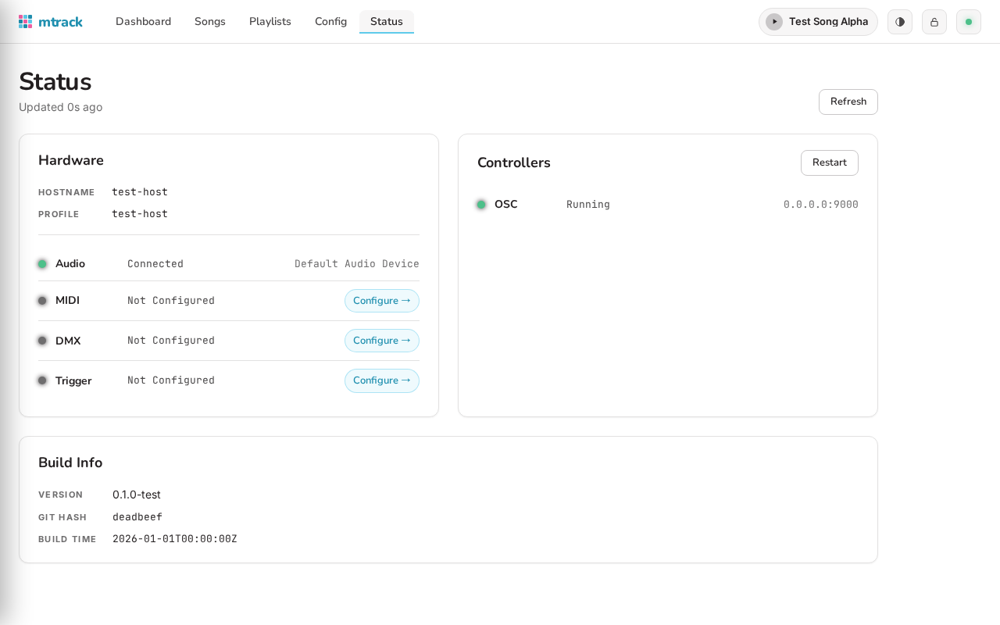

## Phone Layout

Below 720px viewport width, the UI swaps in phone-friendly chrome:

- The top nav's tabs collapse behind a **hamburger drawer** (slide-in from the left, 280px
  wide). Tab and Shift-Tab cycle focus inside the drawer; Esc and a backdrop click close it.
- A sticky bottom **mini-player** with prev / play / next, a song title that taps through to
  the Dashboard, and a lock toggle stays visible across all pages.
- The Songs detail tab bar scrolls horizontally with a fade on the right edge; the MIDI
  channel grid reflows from 16-up to 8-up; and the Lighting tab swaps the timeline editor
  (which needs at least ~1000px to be usable) for a read-only summary listing tempo, show
  and sequence cue counts, and the distinct effect types in the song.
- Editing the Lighting timeline is desktop-only by design. Use a laptop or tablet in
  landscape for cue authoring.

## Directory Structure Requirements

The web UI's management features (song editing, file uploads, lighting file editing, playlist
management, bulk import) expect all project files to live under a single project root directory
— the directory containing `mtrack.yaml`. All file paths in the UI are resolved relative to
this root, and path traversal outside it is blocked.

If your `mtrack.yaml` references files outside the project root (e.g. absolute paths to songs
on a different mount, or a `songs` directory on a separate drive), the web UI will not be able
to manage those files. Songs discovered from external paths will appear in the song list and
play correctly, but editing, uploading, and lighting file management will only work for files
under the project root.

mtrack must have **write access** to the project root and its contents for management features
to work. Read-only filesystems will allow playback but not song creation, file uploads, or
configuration changes from the web UI.

## REST API

The web UI exposes a comprehensive REST API for all management operations. Playback control
uses gRPC-Web (PlayerService). Real-time state streaming uses WebSocket (`/ws`).

All mutating REST endpoints are blocked when the player is in lock mode, returning
HTTP 423 (Locked). Read endpoints, playback control, playlist activation, and validation
endpoints always work.
