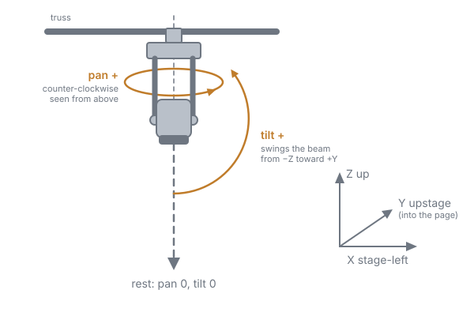
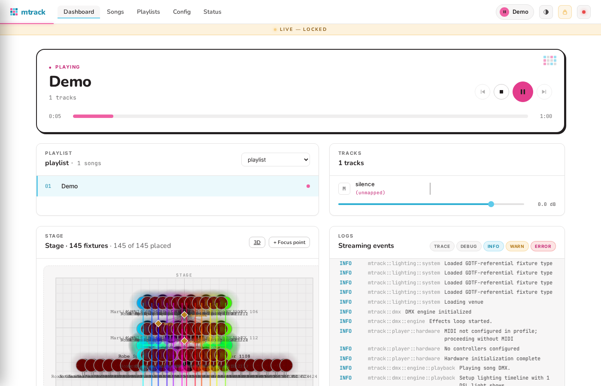
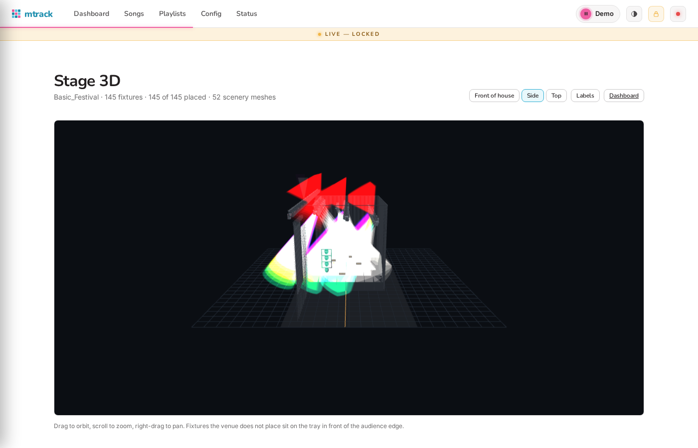
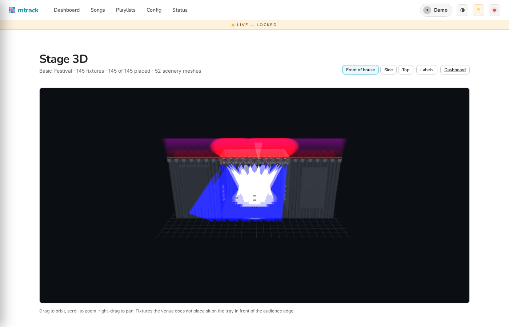

# Lighting Configuration

The lighting system uses a three-layer architecture:

1. **Configuration Layer**: Define logical groups with constraints in `mtrack.yaml`
2. **Venue Layer**: Tag physical fixtures with capabilities in DSL files
3. **Song Layer**: Reference `.light` DSL files in song YAML files, which use logical groups

## Main Configuration (`mtrack.yaml`)

```yaml
dmx:
  # ... existing DMX configuration ...

  # New lighting system configuration
  lighting:
    # Current venue selection - determines which physical fixtures to use
    current_venue: "main_stage"

    # Simple inline fixture definitions (for basic cases)
    # These can be used instead of or alongside venue definitions
    fixtures:
      emergency_light: "Emergency @ 1:500"

    # Logical groups with role-based constraints
    groups:
      # Front wash lights - requires wash + front tags, needs 4-8 fixtures
      front_wash:
        name: "front_wash"
        constraints:
          - AllOf: ["wash", "front"]
          - MinCount: 4
          - MaxCount: 8

      # Moving head lights - accepts moving_head OR spot tags, prefers premium
      movers:
        name: "movers"
        constraints:
          - AnyOf: ["moving_head", "spot"]
          - Prefer: ["premium"]
          - MinCount: 2
          - MaxCount: 4

      # All lights - accepts any light type
      all_lights:
        name: "all_lights"
        constraints:
          - AnyOf: ["wash", "moving_head", "spot", "strobe", "beam"]
          - MinCount: 1

    # Directory configuration for DSL files (auto-discovered)
    directories:
      fixture_types: "lighting/fixture_types"
      venues: "lighting/venues"
```

## Fixture Type Definitions (`lighting/fixture_types/`)

```light
# RGBW Par Can fixture type definition
fixture_type "RGBW_Par" {
  channels: 4
  channel_map: {
    "dimmer": 1,
    "red": 2,
    "green": 3,
    "blue": 4
  }
  special_cases: ["RGB", "Dimmer"]
}

# RGB + Strobe fixture (e.g. Astera PixelBrick in 4-channel RGBS mode)
fixture_type "Astera-PixelBrick" {
  channels: 4
  channel_map: {
    "red": 1,
    "green": 2,
    "blue": 3,
    "strobe": 4
  }
  max_strobe_frequency: 25.0
  min_strobe_frequency: 0.4
  strobe_dmx_offset: 7
}

# Moving Head fixture type definition
fixture_type "MovingHead" {
  channels: 16
  channel_map: {
    "dimmer": 1,
    "pan": 2,
    "pan_fine": 3,
    "tilt": 4,
    "tilt_fine": 5,
    "color_wheel": 6,
    "gobo_wheel": 7,
    "gobo_rotation": 8,
    "focus": 9,
    "zoom": 10,
    "iris": 11,
    "frost": 12,
    "prism": 13,
    "effects": 14,
    "strobe": 15,
    "control": 16
  }
  special_cases: ["MovingHead", "Spot", "Dimmer", "Strobe"]
}
```

### GDTF-referential fixture types (`*.fixture`)

Instead of hand-transcribing a channel map from a manual, a fixture type can
reference a manufacturer [GDTF](https://gdtf-share.com/) file — most
manufacturers publish them — and mtrack distills the chosen DMX mode into the
same model a hand-written definition produces:

```light
# lighting/fixture_types/pb15_pixelbrick.fixture
fixture_type "PB15 PixelBrick"
  from gdtf("lighting/library/pb15.gdtf", mode "8: RGBS")
{
  # Optional overrides — data not in GDTF, e.g. measured movement limits:
  # movement { max_pan_speed: 240deg/s }
}
```

The easiest way to create one is the import command, which lists an
archive's modes, copies it into `lighting/library/`, writes the `.fixture`
file, and verifies it loads:

```sh
mtrack import-gdtf downloaded.gdtf                 # list the modes
mtrack import-gdtf downloaded.gdtf --mode "8: RGBS"
```

Notes:

- The GDTF archive is part of your project (`lighting/library/`) — commit
  it. Expansions live in `lighting/.cache/`, which is rebuildable and should
  be gitignored. Beside them, `lighting/.cache/assets/` holds what the 3D
  stage view draws: the archive's meshes and thumbnail, and a rig model per
  mode (the fixture's yoke, head, beams and pixel cells with their
  transforms), written the first time the type expands.
- A referential fixture's channels come from the GDTF; the `.fixture` body
  carries only overrides. Anything the distiller can't represent (wheels,
  pixel/matrix modes) is skipped or refused with a clear message.
- `.fixture` and `.light` fixture files load side by side; nothing renames
  or migrates.
- When a GDTF's identical sections (a pixel bar's segments, a batten's
  cells) gang to one channel, the distiller also records them as cells —
  their own channels and a transform-derived offset — the same shape a
  hand-written `.fixture` cell block (below) produces. Any sections of one
  fixture that carry exactly the same attributes are treated as cells of one
  pixel array, wherever they sit in its geometry. A section a GDTF template
  instantiates through a `GeometryReference` takes the reference's name
  (`P3 Zone2`, or `Head2/P3` when references nest), which is also the name
  the 3D view gives its lens.
- On a hardened deployment (`mtrack systemd` with `ProtectSystem=strict`),
  `lighting/.cache/` must be writable — pass your project directory (or at
  least the cache path) to `mtrack systemd` so it lands in
  `ReadWritePaths=`. Referential fixtures cannot expand on a fully
  read-only filesystem, since the cache is rebuilt rather than committed.

**Strobe frequency range:**

Fixtures with a dedicated strobe channel can specify their supported frequency range and DMX
offset. This is important because many LED fixtures map the DMX strobe channel linearly to
*period* (1/frequency) rather than frequency, so a simple linear frequency-to-DMX mapping
produces incorrect results. `mtrack` uses period-linear interpolation to match this behavior.

| Field | Default | Description |
|-------|---------|-------------|
| `max_strobe_frequency` | 20.0 | Maximum strobe frequency in Hz |
| `min_strobe_frequency` | 0.0 | Minimum strobe frequency in Hz |
| `strobe_dmx_offset` | 0 | First DMX value where variable strobe begins (values below this are typically "off" or reserved) |

For example, the Astera PixelBrick's strobe channel uses DMX values 7–255 for 0.4–25 Hz. At
10 Hz, `mtrack` sends DMX 248 (period-linear), not 103 (frequency-linear).

#### The universe must exist in olad

olad drops streamed frames for a universe that has no port patched to it, silently: `ola_uni_info`
listing nothing means mtrack's frames are going nowhere, however healthy the connection looks.
Patch your output port to each universe the profile drives (`ola_patch -d <device> -p <port> -u
1`, or the olad web UI) before expecting light.

### Rich channel definitions (`*.fixture`)

When a fixture has no GDTF — the manual is all you have — a `.fixture` file can describe
its channels in full: the fine byte of a 16-bit channel, the physical range a channel
covers, and the functions a channel is divided into. This is what a `move` resolves degrees
through, and what makes a slow sweep smooth on a 16-bit mover.

```light
# lighting/fixture_types/cheap_mover.fixture
fixture_type "Cheap Mover" {
  channel "pan"    @ 1 fine 2 range -270deg..270deg
  channel "tilt"   @ 3 fine 4 range -135deg..135deg
  channel "dimmer" @ 5
  channel "strobe" @ 6 {
    function "open"   0..15
    function "strobe" 16..255 0.5hz..20hz
  }
  channel "red"    @ 7
  channel "green"  @ 8
  channel "blue"   @ 9
  movement { max_pan_speed: 240deg/s }
}
```

One `channel` line per channel: the name, `@` the 1-based offset, then optionally `fine`
with the fine byte's offset, `range` with the physical span the whole channel covers, and a
block of `function` lines each naming a DMX sub-range and, where it maps to something
physical, that span. Units are part of the value: `deg` for angles, `hz` for strobe rates.
The v1 strobe fields are not needed — the strobe function carries the same facts — and a
type uses either `channel` lines or a `channel_map`, not both.

The rich form is the v2 DSL and lives in `.fixture` files only; a `.light` fixture file
keeps the v1 grammar, the loader skips, loudly, a `.light` file that uses it, and the web
UI's fixture-type editor (which writes `.light`) refuses to save it. Both forms stay valid
forever. Rich and referential `.fixture` types are edited by hand or written by import
today; the web UI lists and edits v1 types only.

**Cells:** a pixel fixture — an LED batten with several individually-colored
segments, a pixel mover's ring — can describe each segment as a `cell`
block, with its own channels and where it sits in the fixture's frame
(meters, the same axes a venue's fixture transform uses):

```light
fixture_type "Pixel Bar" {
  channel "dimmer" @ 1
  cell "1" at (-0.3, 0, 0) {
    channel "red" @ 2
    channel "green" @ 3
    channel "blue" @ 4
  }
  cell "2" at (0, 0, 0) {
    channel "red" @ 5
    channel "green" @ 6
    channel "blue" @ 7
  }
  cell "3" at (0.3, 0, 0) {
    channel "red" @ 8
    channel "green" @ 9
    channel "blue" @ 10
  }
}
```

Every cell must carry the same channel names. The fixture-level channels a
show already understands (`red`, `green`, `blue` above) are derived, not
written separately: they are the first cell's, and every other cell's same
channel mirrors it, so a show that never mentions cells still sees one
color across the whole fixture. A show that wants to run something across
the cells instead says `per: cell` on the effect (`bars: chase pattern:
linear, per: cell, duration: 10s`); see [Effects: Common Effect
Parameters](effects.md#common-effect-parameters).

## Venue Definitions (`lighting/venues/`)

```light
# Main Stage venue definition
venue "main_stage" {
  # Front wash lights
  fixture "Wash1" RGBW_Par @ 1:1 tags ["wash", "front", "rgb", "premium"]
  fixture "Wash2" RGBW_Par @ 1:7 tags ["wash", "front", "rgb", "premium"]
  fixture "Wash3" RGBW_Par @ 1:13 tags ["wash", "front", "rgb"]
  fixture "Wash4" RGBW_Par @ 1:19 tags ["wash", "front", "rgb"]

  # Moving head lights
  fixture "Mover1" MovingHead @ 1:37 tags ["moving_head", "spot", "premium"]
  fixture "Mover2" MovingHead @ 1:53 tags ["moving_head", "spot", "premium"]
  fixture "Mover3" MovingHead @ 1:69 tags ["moving_head", "spot"]

  # Strobe lights
  fixture "Strobe1" Strobe @ 1:85 tags ["strobe", "front"]
  fixture "Strobe2" Strobe @ 1:87 tags ["strobe", "back"]
}

# Small Club venue definition (same logical groups work!)
venue "small_club" {
  # Limited front wash (only 2 fixtures)
  fixture "Wash1" RGBW_Par @ 1:1 tags ["wash", "front", "rgb"]
  fixture "Wash2" RGBW_Par @ 1:7 tags ["wash", "front", "rgb"]

  # Single moving head
  fixture "Mover1" MovingHead @ 1:13 tags ["moving_head", "spot", "premium"]

  # Single strobe
  fixture "Strobe1" Strobe @ 1:29 tags ["strobe", "front"]
}
```

**Multiple universes:**

Fixtures may be patched on any universe (`@ universe:address`), and a single
venue may span several. Shows never reference universes — they target logical
groups — so the same show drives a one-universe rig and a four-universe house
patch alike. Every universe a venue references must have an output configured
under `dmx.universes` in the active profile; fixtures patched on an
unconfigured universe are reported at venue registration (and again, once, if
a show drives them) and will not light.

```light
venue "warehouse" {
  fixture "Wash1" RGBW_Par @ 1:1 tags ["wash", "front"]
  fixture "Wash3" RGBW_Par @ 2:1 tags ["wash", "back"]
}
```

### Venue files with positions (`*.venue`)

A venue can also say where its fixtures hang and name the points on stage a
show may aim at. Files using this syntax take the `.venue` extension and load
beside `.light` venues as peers; nothing renames or migrates.

```light
# lighting/venues/kellys_basement.venue
venue "kellys-basement" {
  # Coordinates: meters, right-handed Z-up, origin downstage-center on the
  # deck, +x stage-left, +y upstage. Rotation: the mounting as GDTF models
  # it, degrees about X, Y, Z in order.
  fixture "Spot1" MovingHead @ 1:1 tags ["spot", "rear"]
    position (-2.0, 3.5, 4.2) rotation (0, 0, 180)   # hung, facing downstage
  fixture "Wash1" RGBW_Par @ 1:40 tags ["wash", "front"]
    position (1.5, 0.5, 3.0) rotation (30, 0, 0)     # tipped 30° upstage

  # Named stage points — the positional analog of tags.
  focus "drummer" (0.0, 2.8, 1.4)
  focus "center-stage" (0.0, 1.5, 1.7)
}
```

Position and rotation are optional per fixture, and a venue without them
still plays; it just cannot resolve positional effects or draw a meaningful
stage plot.

#### Mounting and pose convention

`rotation` is the mounting exactly as [GDTF](https://gdtf.eu/) and MVR model it, which is
why an imported MVR's rotations come through unchanged. Three rules cover all of it:

- **Rest — `pan 0`, `tilt 0` — is the mounting frame's −Z: straight down.** That is where a
  fixture with no `rotation` points, static fixtures included — an unrotated PAR points at
  the deck, as its GDTF says.
- **Positive pan is a right-hand rotation about +Z:** counter-clockwise seen from above.
- **Positive tilt is a right-hand rotation about +X:** it swings the beam from −Z toward
  +Y, upstage.



The rotation is degrees about X, Y and Z applied in that order, and it applies outside the
pan and tilt joints, so a fixture's beam direction is `R · Rz(pan) · Rx(tilt) · (0, 0, −1)`.
Three mountings are worth memorizing:

- A mover hung from a truss facing downstage is `rotation (0, 0, 180)` — what an MVR
  import writes for a hung head, and what makes `move pan: 0deg, tilt: 90deg` throw at the
  audience.
- A mover standing on the deck is `rotation (180, 0, 0)`.
- A PAR on a downstage pipe tipped to throw 30° upstage is `rotation (30, 0, 0)`:
  `Rx(30°)` takes the rest beam `(0, 0, −1)` to `(0, sin 30°, −cos 30°)`, up off the deck
  and upstage.

A fixture type imported from a GDTF is aimed through its own geometry: the rig's yoke and
head axes and the lens's rest angle, read from the file, so a fixture whose manufacturer
models the yoke yawed or the lens pitched (the Ayrton MagicDot SX yaws its yoke 90°) is
still aimed where the focus point is. The beam is aimed from the lens, which the geometry
puts a head's length from the mounting point and which moves with the pose, not from the
mounting point itself. The log says so at load
(`Aiming through the rig's geometry`), and says when a geometry cannot be followed and the
plain convention stands in.

The same degrees go on the wire. A `.fixture` file's pan and tilt `range` is in these
degrees too, so a hand-written mover carrying its datasheet's `tilt -135deg..135deg`
behaves like its GDTF would.

#### Importing a venue's MVR

Venues and pre-viz tools exchange rigs as [MVR](https://gdtf.eu/mvr/) files:
a patch list with the referenced GDTF archives embedded. `mtrack import-mvr`
seeds a `.venue` from one, importing every embedded GDTF as a referential
`.fixture` on the way:

```sh
mtrack import-mvr kellys.mvr                          # report only, nothing written
mtrack import-mvr kellys.mvr --origin 0,-3500,0 --write
```

An MVR's origin is wherever the console author put it, so `--origin` names
the MVR-space point, in millimeters, that becomes downstage-center. The bare
form prints every fixture's position so you can pick it; a wrong guess is
corrected by re-running the import with a better one.

The seeded file is yours: tags start empty (shows target tags, not fixture
names), the console's focus-point names are there to rename, and positions
can be corrected by hand. It records where it came from:

```light
venue "kellys" {
  imported from mvr("lighting/library/kellys.mvr") origin (0, -3.5, 0)
  fixture "Spot 1" "Robe Esprite" @ 1:1 position (-2, 3.5, 4.2) rotation (0, 0, 180)  # layer "Front Truss"
  focus "FocusPoint 1" (0, 2.8, 1.4)
}
```

That line is provenance, not a reference — the player never opens the MVR.
When the venue sends a revised file, re-running the import **merges** it:
rig facts (types, patch, positions) come from the new MVR, your tags and
focus names stay, fixtures the venue removed are dropped and reported with
their tags, and fixtures you added by hand are kept. A hand-written venue of
the same name is never overwritten. A patched fixture whose GDTF is missing
or whose mode cannot be matched is never silently dropped either: it becomes
a `# TODO` line in the venue file carrying everything the MVR knew about it.

Going the other way, `mtrack export-mvr <venue>` writes the venue as an `.mvr` a console or
pre-viz tool can open: every fixture with its position, rotation (the origin chosen at import
restored) and address, the focus points, and each fixture type's GDTF embedded from the
library. A fixture type with no GDTF — a `.light` or hand-written `.fixture` — gets a minimal
generated one carrying its channels and a box body, enough to patch. Exports always land in
`lighting/export/`, as `<venue>.mvr` unless `--output` names another file; `--layers-from-tags`
puts each fixture on a layer named after its first tag. Fixture IDs are the number a fixture's
name ends in, else the lowest free one. A venue seeded from an MVR round-trips: importing
the export merges it with nothing changed.

The same flow is available over MCP as `inspect_mvr`, `import_mvr` and `export_mvr`. Pixel bars and
multi-section fixtures import with their identical sections ganged to one color (the report
says so); a fixture with sections that differ keeps its first section's channels as its own and
the rest under section-suffixed names. gdtf.eu publishes sample MVR files from several consoles,
which are a good way to see what an import of your own rig will look like.

## Stage 3D

The dashboard's stage card has a **3D** button that opens the venue as a room: the deck with
the audience edge marked, every fixture at its venue position, movers turning as the show
drives them, beams in the colour and level the fixture is showing, and focus points as
markers. Drag to orbit, scroll to zoom, right-drag to pan; the **Front of house**, **Side**
and **Top** buttons are camera presets, and **Labels** toggles the fixture names (off by
default on a large rig). A pixel fixture — one with cells — lights its lenses per cell when
a show says `per: cell`; the stage plot on the dashboard draws such a fixture as a segmented
disc, one wedge per cell, coloured from the cell's own state.







What a fixture looks like comes from its GDTF: the archive's meshes when it ships them, or
the GDTF's own primitives with their sizes. Pan turns the geometry the GDTF's pan channel
names, tilt the one its tilt channel names, and a beam leaves each beam geometry with the
angle the GDTF states — a 5° spot looks like a spot, a 25° wash like a wash. A fixture type
written by hand has none of this and is drawn as a box with a 20° beam out of its rest
direction, the mounting frame's −Z. Fixtures the venue does not place sit on a tray in
front of the audience edge.

A venue seeded from an MVR also shows the MVR's scenery — decks, trusses, screens — where
the MVR carries it as glTF (`.glb`); scenery in other formats (`.3ds` is common in console
exports) is reported by the import and by the page, and skipped. The room is always dark,
whatever the UI theme, and it is a sketch, not a render: no haze model, no shadows, no
photometrics. The models and rig data it draws live in the asset
store (`lighting/.cache/assets/`, rebuildable) and load only on this page.

## Song Lighting Definitions

Lighting shows are defined in separate `.light` files using the DSL format. Songs reference these files:

```yaml
# Example song.yaml file
kind: song
name: "My Song"
lighting:
  - file: "lighting/main_show.light"  # Path relative to song directory
  - file: "lighting/outro.light"      # Multiple shows can be referenced
tracks:
  - name: "backing-track"
    file: "backing-track.wav"  # Can be WAV, MP3, FLAC, OGG, AAC, ALAC, etc.
```

The `.light` files use the DSL format and can reference logical groups defined in your `mtrack.yaml`:

```light
show "Main Show" {
    # Front wash on - uses logical group from mtrack.yaml
    @00:05.000
    front_wash: static color: "red", dimmer: 80%, duration: 10s

    # Movers join with color cycle - uses logical group
    @00:10.000
    movers: cycle color: "red", color: "blue", color: "green", speed: 2.0, dimmer: 100%, duration: 8s
}
```

> **Note:** All effects require an explicit `duration` parameter. Effects without a duration
> will be rejected by the parser. See the [Effects Reference](effects.md) for details.

See the [Light Show Verification](verification.md) section for information on validating your `.light` files.
